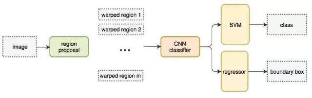
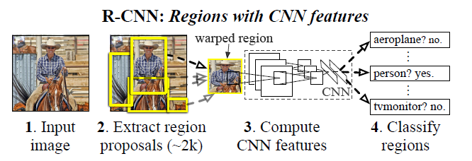
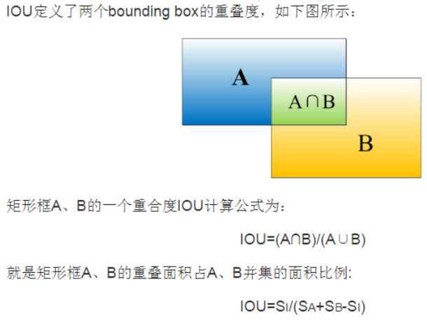

### Rich feature hierarchies for accurate object detection and semantic segmentation

丰富的要素层次结构，用于准确的对象检测和语义分割

**摘要**

在标准的PASCAL VOC度量的目标检测性能在最近几年进入停滞状态。性能最好的方法是复杂的集成系统，通常组合多个低级图像特征和高级环境信息。本文提出一个简单的、可伸缩的检测算法，相对之前在VOC 2012数据集上最好的性能，mAP值提升了超过30%，达到53.3%的mAP值。我们的方法包含关键的两点洞悉: (1)可以将高容量的CNN应用到自底向上的region proposals中来定位和分隔对象；(2) 当标注训练数据缺乏时，可以监督预训练辅助任务，然后再做domain-specific精调，可以获得显著的性能提升。因为组合了region proposals和CNNs,我们的方法称作R-CNN：带CNN特性的Regions。我们同样将R-CNN与OverFeat比较，OverFeat是最近提出的基于类型CNN架构的滑动窗口检测器。在200类的ILSVRC2013检测数据集上，R-CNN性能大幅度超过OverFeat。整个系统的源码可在http://www.cs.berkeley.edu/~rbg/rcnn获得。

***
其他的经典架构系列 点击此处[SSPNet](SSPNet.md)、[FastRCNN](FastRCNN.md)、[FasterRCNN](FasterRCNN.md)

paper中采用的架构是AlexNet+候选区域+SVM分类器和回归器   （也就是pretrain + fine-turning）

预处理：在特征提取前，需要把候选区域归一化成同一尺寸227*227

**RCNN架构**

**paper创新点**

关注两个问题：使用深度网络**定位对象** 和 **使用少量标注的检测数据训练大容量的模型**。

采用滑动窗口模式来精确定位会导致大量的运算，技术难度较大--->借鉴 对象检测和语义分割 思想，提出了region proposal---->提取特征向量---->仿射变换计算出一个固定尺寸的CNN输入----》 SVM分类器

如下图所示：处理的基本流程

面对标注数据太少的挑战：传统方法是采用无监督预训练，再经过有监督精调。本文的第二个核心贡献是在辅助数据集 (ILSVRC)上进行有监督预训练，再在小数据集(PASCAL)上针对特定问题进行精调。

***
**相关知识**

1）mAP（mean average precision ）：平均精度

Ground Truth：训练集对监督学习技术的分类的准确性。
参考：https://www.zhihu.com/question/22464082/answer/21443035

2）NMS

 non maximum suppression: 中文名非极大值抑制. 非极大值抑制算法（Non-maximum suppression, NMS）的本质是搜索局部极大值，抑制非极大值元素。

3）hard negative mining method

​ 首先是negative，即负样本，其次是hard，说明是困难样本，也就是说在对负样本分类时候，loss比较大（label与prediction相差较大）的那些样本，也可以说是容易将负样本看成正样本的那些样本。

>比如:要在一张厨房的图像里判别一只蜘蛛。由于厨房的图像里objects(负样本)可能有许多，蜘蛛（正样本）样本却很少。这时候hard mining的意义就是选出一些对训练网络有帮助的负样本部分，而不是所有负样本，来训练网络。比如说，training过程中，被当前模型误判成蜘蛛最厉害的那些负样本可以被挑出来，参与loss运算以及back propagation。

4）[OverFeat](OverFeat.md)

OverFeat说的简单一点就是特征提取算子，就相当于SIFT，HOG等这些算子一样。采用的是FCN思想。

5） offset max-pooling

类似于XGboost思想，同时训练多个预测结果，然后取最大值，作为此类别的概率值。

6） 边框回归

简单来说就是怎么让原始输入的边框（ss算法生成的边框）与目标边框（Ground Truth）接近，生成新的回归窗口。
里面涉及到的算法推导见博客：https://blog.csdn.net/zijin0802034/article/details/77685438/

7) IOU

8) Region Proposal (候选区域)：常用的方法---- SelectiveSearch （SS，选择性搜索）、Edge Boxes（EB）
---
SS算法：

- step0：生成区域集R，具体参见论文《Efficient Graph-Based Image Segmentation》
- step1：计算区域集R里每个相邻区域的相似度S={s1,s2,…}
- step2：找出相似度最高的两个区域，将其合并为新集，添加进R
- step3：从S中移除所有与step2中有关的子集
- step4：计算新集与所有子集的相似度
- step5：跳至step2，直至S为空

论文考虑了颜色、纹理、尺寸和空间交叠这4个参数。

合并规则

优先合并以下四种区域：
- 颜色（颜色直方图）相近的
- 纹理（梯度直方图）相近的
- 合并后总面积小的
- 合并后，总面积在其BBOX中所占比例大的

第三条，保证合并操作的尺度较为均匀，避免一个大区域陆续“吃掉”其他小区域。

第四条，保证合并后形状规则。

**SVM**

 以前也看了几次关于SVM的推到，应用，但是一直都是迷迷糊糊， 懵懵懂懂的，直到今天无意中找到了这位[博主](https://www.bilibili.com/video/av28186618?from=search&seid=651803500485512165)手推SVM原理，结合[July](https://blog.csdn.net/v_july_v/article/details/7624837#commentBox)的博客，简直完美。~~当然看完这两个至少得半天时间了~~

 补充一点：关于机器学习的推到[博主](https://www.bilibili.com/video/av28186618?from=search&seid=651803500485512165)都放在他的[github](https://github.com/shuhuai007/Machine-Learning-Session)，再次感谢博主无私分享！！！
