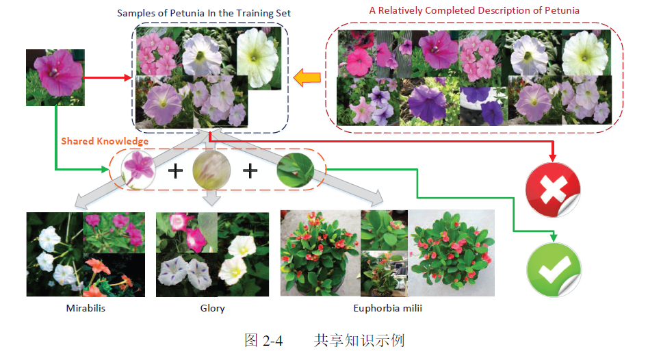
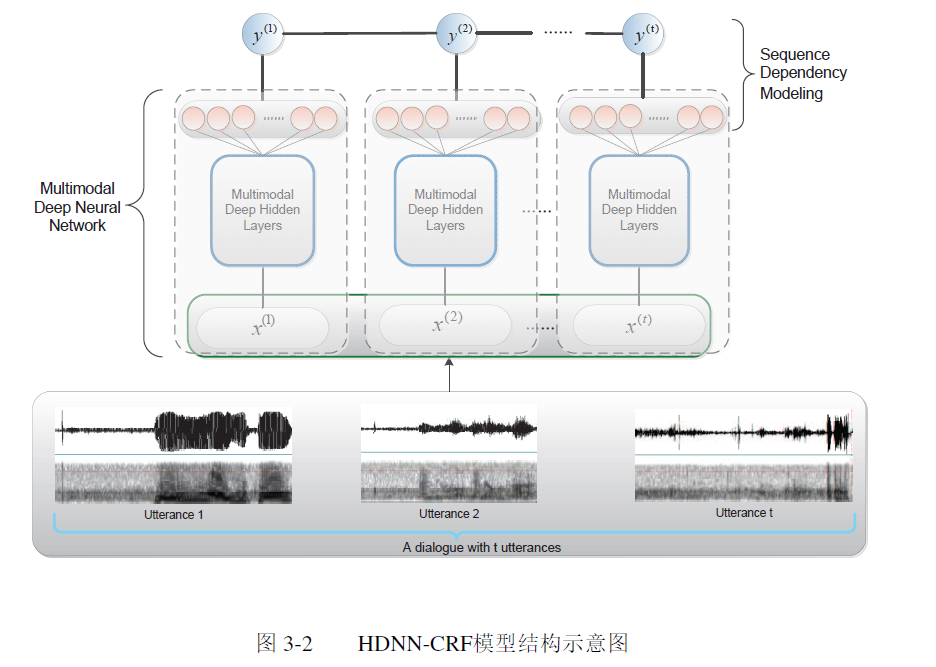
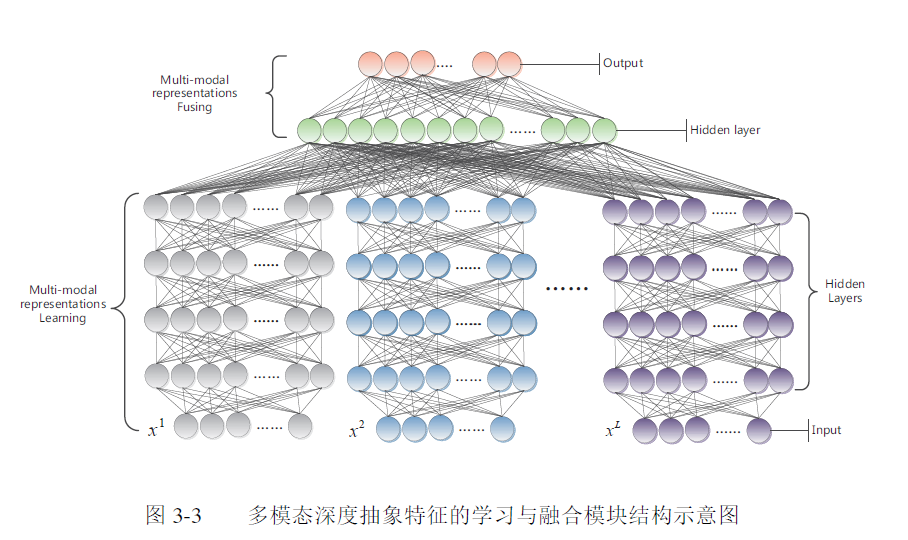
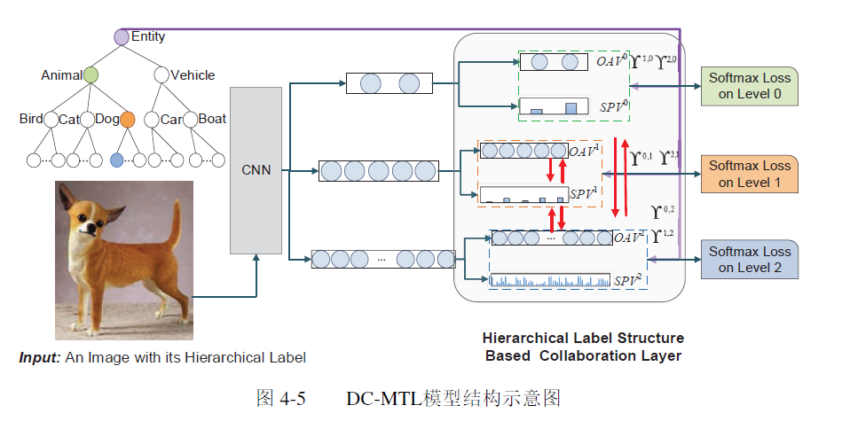
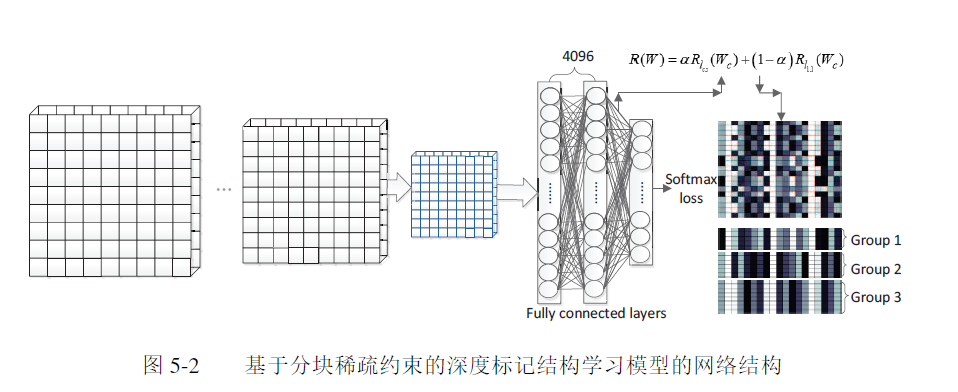

### Label Structure Based Deep Learning for Long-Tail Distributed Classification
### 面向长尾分布分类任务的结构化深度学习模型与算法
****

**本论文 主要讲解三个方面的研究问题， 具体如下：**

(1)基于标记一阶线性关联关系的深度学习算法   -------------------- 第三章

&nbsp;&nbsp;&nbsp;&nbsp;将单个类别的样本分布建模问题转化为样本序列的建模问题。标记之间的概率依赖关系，在此基础上。结合深度学习与条件随机场，使其既能完成标记的关联关系又具有特征学习能力。

(2)基于标记高阶分层结构的多任务协同学习网络 -----------------------  第四章

&nbsp;&nbsp;&nbsp;&nbsp;motive： 针对当前自顶向下分层分类策略中误差传递的缺点

(3)基于深度神经网络的标记结构优化学习 ------------------------ 第五章

&nbsp;&nbsp;&nbsp;&nbsp;目的： 为了使标记结构建模对于一般问题具有普适性，研究了标记结构自动构建算法。处理复杂的长尾分布分类问题上的本质缺陷，基于特征空间和决策空间的异质性要求，以分块稀疏约束为主要技术手段。提出了将 `特征提取`、`分类器训练`和`标记结构学习`进行联合优化的统一深度神经网络模型和求解算法。

---
### 综述

**机器学习算法在解决长尾分布问题时面临着以下几方面的挑战：**

1） 由于大部分类别（尾部类别） 包含的样本数目较少，即大部分类别的统计特性不强，但是这些类别往往具有更高的识别价值。因此。如何提高这些类别的统计特性，对基于均匀分布的传统方法进行改进也是一个重要课题

2）较大的类内差异性与较小的类间差异性对所选择特征空间的判别性提出了更高的要求，为了解决这一问题，分类模型急需要体现不同类别之间的区分性，又需要在同一类别上具有较强的泛化能力。

3)样本类别的丰富性加大了模型的建模难度和求解速度。如何在超大的解空间中，准确快速地定位样本所对应的标记，是传统的多酚类策略需要解决的问题。

**针对以上的问题paper给的解决方案：  深度学习模型和标记结构辅助建模。**

详细方法： 
1）针对小样本类别统计特性不强的特点，传统基于采用的方法和基于代价敏感函数的方法分别通过均衡化和增大小样本类别损失权重来增强小样本类别在训练阶段的重要性。不足之处，会影响其他类别上的分类能力下降（比如大样本的识别精度等），针对此问题，可以借助 标记之间的关联关系，将单个类别的样本转化为两个不同类别的样本对甚至是多个类别的样本集合，降低样本分布不均的影响（通俗点讲，就是将大的样本拆分成小的样本，降低样本分布不均的问题）。

上述问题又带来了新的问题，会造成 标记空间的含量增长。可以采用分治的思想（类似于n叉树，来降低时间复杂度）。

将标记空间进行逐层分组后，分布在尾部的标记可以借鉴其同组标记的共享知识和样本来提高自身的统计特性。（~~这句话没明白，怎么借鉴同组标记的共享知识和样本？？？~~）

2）针对 长尾分布的类内差异性较大与类间差异性较小的特点，对所选的特征空间的判别提出了更高的要求。
目前针对扁平的标记结构，已经有很多工作[192]研究如何借助深度学习更好的提取满足特定要求的样本特征。但是对于考虑标记结构的深度神经网络建模方式，还没有相关的文献进行深入研究。

---
研究现状：四个问题----------------  **长尾分布分类**、**结构化分类器**、**深度神经网络**、**标记结构学习**。

>**长尾分布分类**：
>>处理不均衡的方法主要包含两类：数据预处理的方法和算法改进方法。
>>数据预处理方法的目标：将不均衡分布转化为均匀分布，主要包括，`下采样方法`，`上采样方法`和`虚拟数据生成方法` &nbsp;&nbsp;&nbsp;&nbsp;
                下采样的方法很有可能丢掉一些重要样本，从而降低大样本类别的识别率。而上采样和虚拟数据生成的方法虽然增强了小样本类别的统计特性，但是无法对其类边界进行已有样本描述之外的有效扩展，同时也带来了额外的计算时间消耗。

>>标记结构地引入。可以使长尾分布分类任务地识别准确率得到很大程度地提升。

>**结构化分类器：**

>>本小结主要介绍基于标记线性关联和分层结构的相关建模方法。

>> 隐马尔科夫（HMM）和条件随机场（CRF）是两个常用的先行概率图模型。

>**深度神经网络：**

>> 如何充分利用神经网络的权重矩阵自动地挖掘标记之间的关联关系，构建能够有效提高分类准确率的标记结构仍然需要进一步地研究和探索。

>**标记结构学习：**

>>标记结构的构建方法主要分为：`结构提取` 和 `结构学习两大类`

>>标记结构提取：指的是从已有的标记语义结构中提取数据集标签相对应的结构[85-87]

>>标记结构学习：自动地学习比较之间的关联关系

### 第二章 研究基础

本章介绍相关的研究基础，主要包括不均衡分类任务建模面临的困难、大规模长尾分布分类的挑战、标记结构对于解决不均衡分类的有效性分析以及一阶线性关联关系和高阶树状分层关系中常用的标记结构建模方法。

**标记结构**

论文中以 矮牵牛花分类为了，在共享知识进行类别判定的示例中，加上限制就可以实现正确的分类,具体如下所示

**分层分类算法**

>基于标记结构构建方法主要分为两类： `基于语义结构的方法`和`基于学习的方法`。后者比前者更具有普适性。

>基于学习的方法：该方法的核心问题在于如何定义两个类别之间的关系，目前主要包括基于混淆矩阵的方法和基于标记相似性的方法。前者结果并不理想，主要讲解后者。基于标记相似性的方法降低了样本分布对影响，其关键在于计算两个类别之间的相似性。

### 第三章  基于标记一阶线性关联关系的深度学习算法

**CRF（conditional random field algorithm）**： 在标记序关系建模中，最常用的是概率图模型中的线性链条件随机场模型。通过  转移特征函数 和 状态特征函数 分别对标记之间的关联关系、标记与特征的判别关系进行建模。缺点，不适合处理负责特征或特征与标记之间是高阶判定关系。

**深度神经网络**： 可以通过对输入特征进行多层复杂的非线性变换，自动学习到抽象表达。。。。 弥补了CRF的缺陷

在本章中，结合了  **`CRF+深度神经网络`**  提出了一个 用于高效处理复杂的标记之间存在线性关联关系的序列模型。 
（*简言之：1、提出了CRF+深度神经网络的序列模型 2、分析了相互作用方式，并给出了训练与测试算法  3、进行了实验验证*）

> 多模态深度神经网络与条件随机场联合建模

>>对话行为标签有三类：`普通标签集、中断标签集和特殊标签集`。

>>**模型结构**:基于条件随机场与多模态深度神经网络（the HeterogeneousDeep Neural Networks with Conditional Random Fields, HDNN-CRF）
包括三部分： 特征提取、多模态深度抽象特征的学习与融合、序列依赖关系建模   
 >>特征提取利用现有学者研究的语料库资源， 多模态深度抽象特征的学习与融合模块 是以深度神经网络为基础（图3-3）对于序列依赖关系建模部分，本章以CRF模型为基础，利用多模态深度抽象特征的学习与融合模块的输出对其中的状态转移函数进行重新定义，提高经典CRF模型的判别能力。

下面是该模型的结构示意图

 ~~关于模型涉及的算法和相关概念见论文相关章节~~

 **实验分析与评价**

对话行为识别任务的复杂性，需要使用复杂分类模型来解决。但是，与浅层分类模型相比，DNN模型并没有取得很明显的性能提升

引入标记之间的一阶线性关联关系后，可以有效地提高不均衡分类任务的识别结果。

局限性： 
1）HDNN-CRF 只能处理类别数目较少的序列标注问题，不适合大规模数据，否则会导致 模型呈指数增长，求解困难
 2） 仅仅实用于标记之间存在上下文关联关系的分类任务。对于一般的不均衡分类问题难以应用HDNN-CRF进行建模

未来工作：将研究针对一般大规模长尾分布分类任务具有普适性的建模方法和求解算法。

### 第四章   基于标记高阶分层结构的多任务协同学习网络

**本章提出了基于深度神经网络的多任务协同学习框架（Deep Collaborative Multi-Task Learning Model, DC-MTL）**

本章将每个任务最后一个全连接层划分为两个分支：一个分支存储该全连接的**原始输出**(the Original Activation Value，`OAV`)，另一个分支基于原始输出计算其相应的**softmax值**(the Probability Value of Softmax，`SPV`)，用来表示对于当前决策的置信度。

本章的贡献如下：
- 提出了基于深度神经网络的多任务协同学习框架  
- 设计了一个巧妙地融合函数，（该函数可以根据每个任务对于自身决策地置信度自动地调整两者之间地权重，此外，还有可能修正错误）
- 进行实验，证明了DC-MTL模型可以提升中间层和叶子层分类任务地准确性

 模型结构如下所示：
 

 ~~关于模型涉及的算法和相关概念见论文相关章节~~

 **本章小结**

本章主要提出并讲解了**融合函数**，该函数满足以下三点：
- 当某个任务对自身分类器判断结果十分肯定时，其他任务的反馈结果比重应该比较小。
- 融合函数需要过滤掉负向反馈，只考虑正向反馈
- 正向反馈在融合时应该根据其取值地重要性发挥不同地作用。

 文中提出的未来工作 
 >在未来研究工作中，将研究如何设计更加有利于分类器逐层识别地标记分层结构。 
 >由于上层父节点对于其相连子节点地反馈作用完全相同，导致DC-MTL模型对于叶子层识别结果地提升有限，因此还需要进一步研究区分属于同一个父节点地多个子节点类别地方法

### 第五章 基于深度神经网络的标记结构优化学习

本章以深度神经网络模型为基础，设计了分块稀疏正则项并将其引入到网络分类层，使得标记结构可以根据学习过程中的特征、分类器的状态进行实时调整。

本章的贡献主要包括两个方面：
- 基于特征空间上相似性和决策空间上判别性的一致性原则，`构建了一个能够同时完成特征提取、分类器训练和标记结构学习的网络模型`。
- `设计了分块稀疏正则项并将其应用到神经网络分类层的权重参数上`，由于分类层参数反映了每个类别对于当前特征空间的评价，使得学习到的分类层网络参数可以自动捕捉类别结构。

本文提出的模型是基于`VGG-S 模型`改造而来的， 在DSCL模型中，对分类层的权重参数添加了一项新的正则约束。该正则项由`列稀疏约束`和`元素稀疏约束`两项构成，它们共同作用*使得权重参数自动归并到不同的分组，然后标记的结构可以根据权重参数的结构推导出来*。

**本章小结**

现在基于标记分层结构的思想来解决大规模长尾分布分类问题的研究还比较少，本章提出的工作还有需要进一步完善的内容。在未来的研究中，`将探讨如何针对描述概念空间大小的不同采用不同的特征来区分不同类型的标记`。

`本章局限性`：只考虑了真实标记的上层虚拟标记，如果在虚拟标记上递归的使用该方法可以构造深层次的虚拟标记，形成概念范围逐步扩大的多层标记结构。将进一步提高大规模分类算法的效率；设计新的分层分类模式，使得标记结构学习和建模能够在同一个模型中进行 也具有重要意义。

----
### 补充的知识点（概念为主）：

1、**长尾分布**

百度的：有两方面：一方面，这种分布会使得你的采样不准，估值不准，因为尾部占了很大部分。另一方面，尾部的数据少，人们对它的了解就少，那么如果它是有害的，那么它的破坏力就非常大，因为人们对它的预防措施和经验比较少。也要所谓的二八法则。https://www.cnblogs.com/huangshiyu13/p/6217180.html   
个人理解的： 就是 尾部占有大部分样本，并且这些样本的数据很少。

需要解决的问题： 长尾分布分类要解决的关键问题是如何有效地解决小样本类别由于样本缺乏导致的统计特性不强，无法充分刻画其类内差异性的问题

2、**条件随机场**

详见博客： https://www.cnblogs.com/Determined22/p/6915730.html

（1）可以为每个 HMM 都建立一个等价的 CRF（记号中的 s、l 就是本文的 x、y ）：
（2）CRF 的特征可以囊括更加广泛的信息：HMM 基于“上一状态to当前状态”的转移概率以及“当前状态to当前观测”的释放概率，使得当前位置的词（观测）只可以利用当前的状态（词性）、当前位置的状态又只能利用上一位置的状态。但 CRF 的特征函数中，输入包含 (yi−1,yi,x,i)(yi−1,yi,x,i) ，对于当前位置 i 来说可以利用完整的 x 信息。

（3）CRF 的参数的取值没有限制，而 HMM 的参数（转移概率矩阵、释放概率矩阵、初始概率向量）都需要满足一些限制。

隐马尔可夫和条件随机场 主要应用于语音识别、动作检测、文本解析、图像标注、信息提取和蛋白质结构建模等领域

3、**下采样与上采样**

下采样的方法是将样本数目较多的类别通过一定的采样方法选出一些与小样本类别样本数目相当的样本进行模型训练，而上采样方法则是通过采样的方式增加小样本类别的样本数目

4、**虚拟数据生成**

虚拟数据生成的主要思想是通过小样本类别的已有样本，采取差值等方法生成一些该类别的虚拟样本。

PS：下采样的方法很有可能丢掉一些重要样本，从而降低大样本类别的识别率。而上采样和虚拟数据生成的方法虽然增强了小样本类别的统计特性，但是无法对其类边界进行已有样本描述之外的有效扩展，同时也带来了额外的计算时间消耗。为了对小样本类边界进行准确估计，Hariharan[29]和Yin[30]通过将大类别样本之间的不同变化方式迁移到小样本上来进行小样本类别的样本扩充，但是这种强制迁移的效果严重依赖于源类别与目标类别直接的相似变换关系。

5、**代价敏感函数**

通过对像样本类别的错误惩罚[31-32]或者放松对小样本类别分类超平面的约束[33]使尽可能多的小样本类别准确识别出来。不足之处，牺牲了大样本的准确率，改进方法，Sun[19]和Cheng[20]根据标记之间的相似关系设计了基于样本对和样本三元组的损失函数，将单个样本的输入转换为样本对和样本三元组的输入，降低了样本分布不均的影响。之后还有学者提出改进。但这种方法对于处理 在不损失大样本类别精度情况下处理不均衡问题的一种有效方法，但是对于长尾分布本身样本数就是海量的，会带来模型训练困难。可以 借助标记之间的其他关联关系设计高效地处理不均衡数据地方法！相关文献见[36-38]

6、**不均衡分类**

是指在分类任务中，用于训练模型的数据集中不同类别下的数量差别巨大。例如：目标检测、场景解析、文本处理、产品推荐

数据均衡化：采用采样方法或者虚拟数据生成的方法，将数据集在训练分类器之前进行预处理，使不同类别的样本数目相当
代价敏感方法：通过吉大对小样本类别损失的权重，使小样本类别的损失在优化过程中发挥作用。
（以上两种方法在一定程度上缓解了小样本类别的识别难度，但是并未从根本上解决问题）

7、`OAV`----- the Original Activation Value  全连接的原始输出  
&nbsp;&nbsp;&nbsp;&nbsp;&nbsp;&nbsp;`SPV`    ------ the Probability Value of Softmax  基于原始输出计算其相应的softmax值

8、**ST-Ex 方法**

&nbsp;&nbsp;&nbsp;&nbsp;ST-Ex方法指的根据从WordNet或者是其他领域知识中抽取的标记之间的语义关系将不同的标记进行合并，这种基于语义关系的标记结构在许多
任务中被用来提高最终效果。对于SUN数据集，由于其自己包含一个人工标注的标记分层结构，所以直接从分层结构中第二层的信息用来合并不同类别。但是对于Oxford数据，由于缺乏对于不同种类鲜花之间的相关性，无法获得标记之间的语意结构。

**AM-SP 方法**

&nbsp;&nbsp;&nbsp;&nbsp;AM-SP指的是曲等人提出的方法[59]。之前标记之间的关系是通过两个标记之间所有样本对的相似性来定义的，该方法通过使用样本之间的统计
量简化标记关系的计算。然后，对得到的关系矩阵使用分层的谱聚类方法得到标记的分层结构。在本章中，为了简化问题，本章只研究标记的一层聚类结构。因此，使用经典的谱聚类算法即可。

**CM-SP 方法**
&nbsp;&nbsp;&nbsp;&nbsp;CM-SP方法基于谱聚类算法和混淆矩阵学习标记结构。首先，训练一个逻辑斯特回归分类器，并基于分类结果计算混淆矩阵。然后，将混淆矩阵输入到谱聚类算法中学习标记结构。

***
### 文章小结：

通过以上三个方面的研究，`标记之间的关联关系`可以作为样本描述的类别特征的一种补充知识，对于完善类别的刻画，尤其是小样本类别的刻画，对提高不均衡分类的准确率具有重要意义。此外`标记的树状分层结构`对于处理大规模**不均衡分类任务**具有重要意义。因此，在实际解决不均衡分类问题时。有效地利用标记之间的关联关系，同时辅助其他技术手段增强小样本类别的统计特性，可以大幅度的提高最终识别效果。
