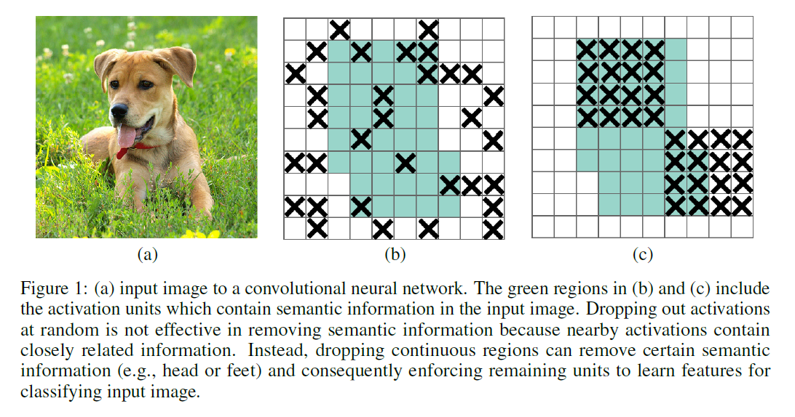
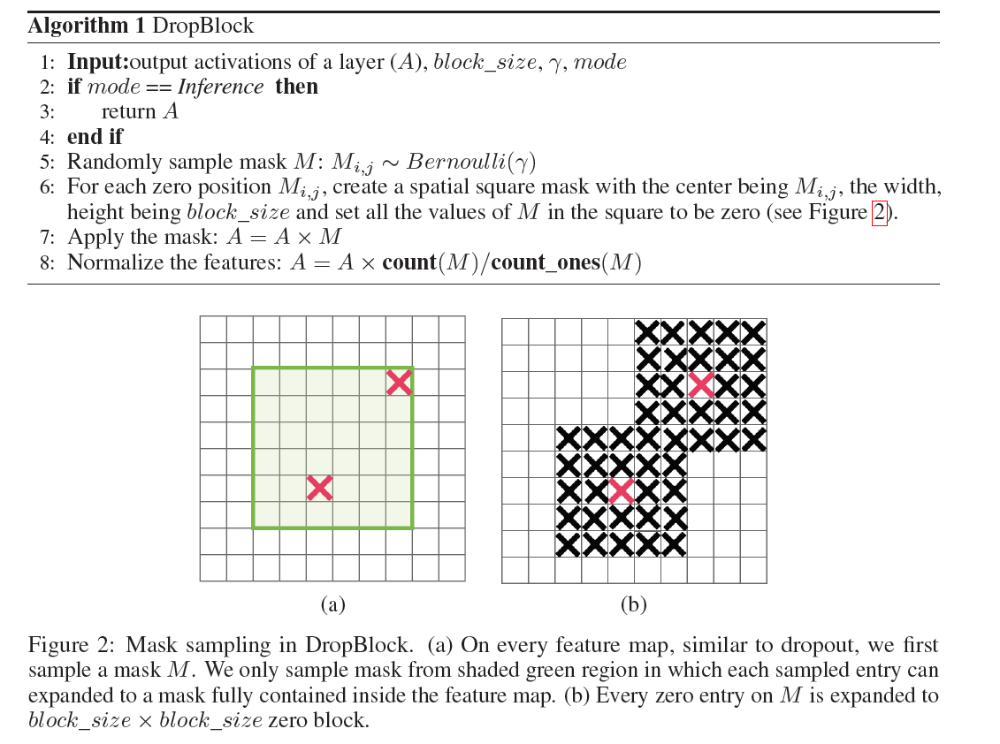
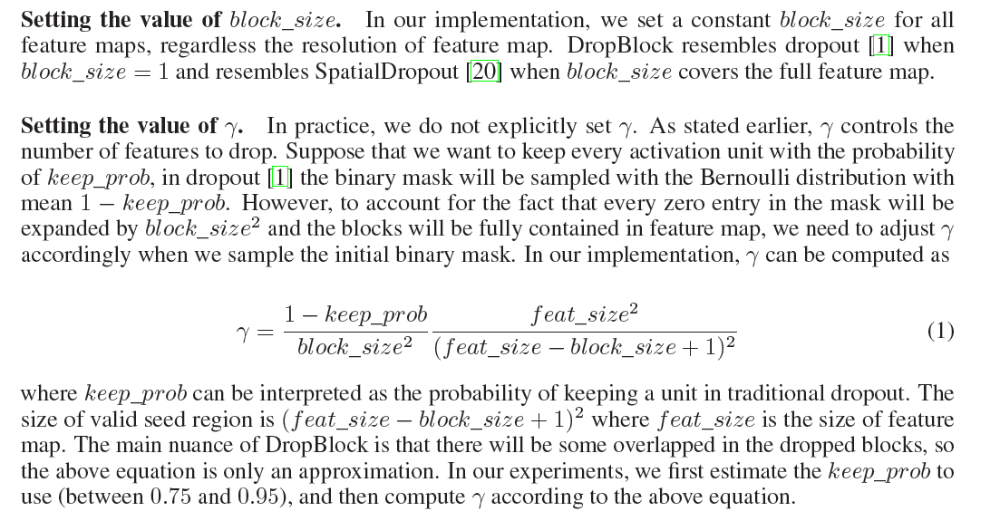
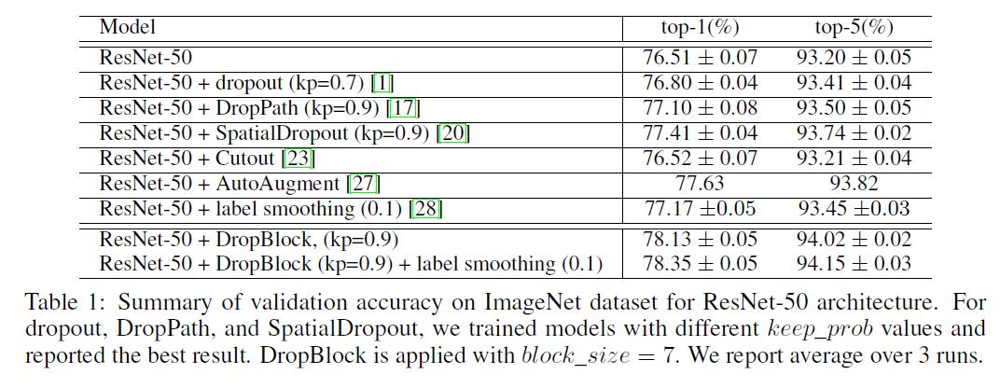
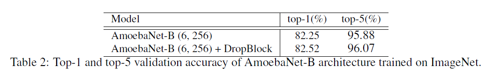
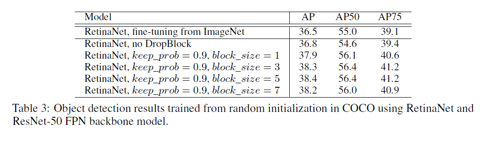
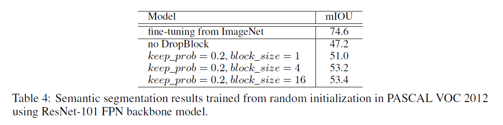

### DropBlock: A regularization method for convolutional networks

### DropBlock：卷积神经网络的正则化方法
***

文中指出，在目前的神经网络训练的广泛实践中，全连接网络加DropOut是一种有效的正则化方法，但将DropOut加到卷积层却往往难以奏效。

为什么会这样呢？

作者认为这是因为卷积层的特征图中相邻位置元素在空间上共享语义信息，DropOut方法在整幅特征图随机丢弃元素，但与其相邻的元素依然可以保有该位置的语义信息。

为了更加有效丢弃局部语义信息，激励网络学到更加鲁棒有效的特征，应该按块(block)丢弃(drop)，这就是DropBlock的由来。

请看下面示意图：

上图中绿色区域代表卷积层后的激活层特征图中带有语义信息的区域。

(b)为使用DropOut的示意图，即在整幅特征图中随机丢弃一些元素的结果，虽然绿色区域有元素被丢弃，但因为特征元素之间空间上的语义信息相关性，这种操作并不能有效激励网络学习剩下的区域的语义特征。

（c）图为DropBlock方法，语义信息区域被空间连续的丢弃，使得网络不得不专注于剩余含有语义信息区域中特征的学习。

#### 算法思想

dropBlock 有两个主要的参数 `block_size` 和 `γ`  
`blocksize`:  需要丢弃的block的大小,即用来控制进行归零的block大小 
`γ`：控制丢失多少个激活单元,用来控制每个卷积结果中，到底有多少个channel要进行dropblock

上图中绿框以内是按照block_size计算得来的可以生成种子点的区域（为了保证block不出特征图），红色X标出的元素即为种子点，黑色X标出的元素即为置0的区域。

#### 实验结果

为了验证该方法的有效性，作者在ImageNet图像分类、COCO目标检测、PASCAL VOC 2012语义分割等三个大型真实世界数据库上的不同任务中做了实验。都有显著的性能提升。

ResNet-50网络+DropBlock在ImageNet验证集的结果，显著提升了分类精度。

下图是在state-of-the-art分类网络AmoebaNet上加DropBlock的结果，top1和top5都取得了稳健提升。

下图是使用RetinaNet检测网络加DropBlock在COCO目标检测任务上的结果，依然表现优异。

下图为RetinaNet语义分割网络从随机初始化开始加DropBlock，在VOC2012语义分割任务中的提升结果。

#### 总结

实验表明，除了卷积层之外，在skip  connections 中应用DropBlock可以提高精度。此外，在训练期间准建增加的丢弃单元数导致更高的准确性，并且对超参数选择更加稳健

该文想法也很有启发性，结果有说服力

#### 个人的一点启发和疑惑

全连接层将卷积层展开成向量之后不还是要针对每个feature map进行分类，而GAP（Global Average Pooling）的思路就是将上述两个过程合二为一，如果将GAP和DropBlock联合起来，重新改造，既可以减少参数数量又能有效的防止过拟合。

论文中关于γ的等式 是根据什么原理推到出来的，有没有更优化的方式改进？ 可不可以借鉴于语义网知识，不仅仅是丢弃的Block_size的大小，而是借鉴语义信息，更好的找到彼此相关的语义信息，重新设计block_size大小。（`个人目前的小思路就是 借鉴本文思想，在feature map中 drop多个 block_size，并且不是简单的取周围大小`）

[论文下载链接](https://arxiv.org/abs/1810.12890v1)  
[DropBlock in Tensorflow](https://github.com/DHZS/tf-dropblock) 
[DropBlock in PyTorch](https://github.com/miguelvr/dropblock/blob/master/dropblock/dropblock.py)
