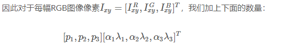
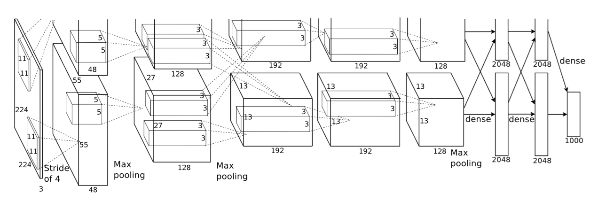

### AlexNet网络结构

---
 该网络使用`5个卷积层和3个全连接层`。  
 激活函数使用地是 ReLU( 论文中写道：采用ReLU的深度卷积神经网络训练时间比等价的tanh单元要快几倍)  
 网络结构：
 
图 1：我们CNN架构图解，明确描述了两个GPU之间的责任。在图的顶部，一个GPU运行在部分层上，而在图的底部，另一个GPU运行在部分层上。GPU只在特定的层进行通信。网络的输入是150,528维，网络剩下层的神经元数目分别是253,440–186,624–64,896–64,896–43,264–4096–4096–1000（8层）。

**整体架构描述**

网络包含8个带权重的层；前5层是卷积层，剩下的3层是全连接层。最后一层全连接层的输出是1000维softmax的输入，softmax会产生1000类标签的分布。我们的网络最大化多项逻辑回归的目标，这等价于最大化预测分布下训练样本正确标签的对数概率的均值。

第2，4，5卷积层的核只与位于同一GPU上的前一层的核映射相连接（看图2）。第3卷积层的核与第2层的所有核映射相连。全连接层的神经元与前一层的所有神经元相连。第1，2卷积层之后是响应归一化层。3.4节描述的这种最大池化层在响应归一化层和第5卷积层之后。ReLU非线性应用在每个卷积层和全连接层的输出上。

第1卷积层使用96个核对224 × 224 × 3的输入图像进行滤波，核大小为11 × 11 × 3，步长是4个像素（核映射中相邻神经元感受野中心之间的距离）。第2卷积层使用用第1卷积层的输出（响应归一化和池化）作为输入，并使用256个核进行滤波，核大小为5 × 5 × 48。第3，4，5卷积层互相连接，中间没有接入池化层或归一化层。第3卷积层有384个核，核大小为3 × 3 × 256，与第2卷积层的输出（归一化的，池化的）相连。第4卷积层有384个核，核大小为3 × 3 × 192，第5卷积层有256个核，核大小为3 × 3 × 192。每个全连接层有4096个神经元。

**数据增强**

 为了增大数据样本，采用了两种方式：
 - 包括产生图像变换和水平翻转：我们从256×256图像上通过随机提取224 × 224的图像块实现了这种方式，然后在这些提取的图像块上进行训练。这通过一个2048因子增大了我们的训练集，尽管最终的训练样本是高度相关的。没有这个方案，我们的网络会有大量的过拟合，这会迫使我们使用更小的网络。在测试时，网络会提取5个224 × 224的图像块（四个角上的图像块和中心的图像块）和它们的水平翻转（因此总共10个图像块）进行预测，然后对网络在10个图像块上的softmax层进行平均。
 - 包括改变训练图像地RGB通道 的强度。具体地，我们在整个ImageNet训练集上对RGB像素值集合执行PCA。对于每幅训练图像，我们加上多倍找到的主成分，大小成正比的对应特征值乘以一个随机变量，随机变量通过均值为0，标准差为0.1的高斯分布得到。
 
> pi，λi分别是RGB像素值3 × 3协方差矩阵的第i个特征向量和特征值，αi是前面提到的随机变量。对于某个训练图像的所有像素，每个αi只获取一次，直到图像进行下一次训练时才重新获取。这个方案近似抓住了自然图像的一个重要特性，即光照的颜色和强度发生变化时，目标身份是不变的。这个方案减少了top 1错误率1%以上。

---

**归纳**
参考博客：https://blog.csdn.net/guoyunfei20/article/details/78122504#commentBox
 
https://blog.csdn.net/qq_24695385/article/details/80368618#commentBox
  

`整体架构`

 
AlexNet为8层结构, 其中前5层为卷积层，后面3层为全连接层；学习参数6千万个 ，神经元65万个
- 在两个GPU上运行
- 在第2，4，5层均是 前一层自己GPU内 连接, 第3层是与前两层全连接，全连接是2个GPU
- ReLU在每个卷积层以及全连接层后。
- 卷积核大小数量：
> conv1:96 11*11*3(个数/长/宽/深度)

> conv2:256 5*5*48

> conv3:384 3*3*256

> conv4: 384 3*3*192

> conv5: 256 3*3*192

ReLU、双GPU运算：提高训练速度。（应用于所有卷积层和全连接层）

重叠pool池化层：提高精度，不容易产生过度拟合。（应用在第一层，第二层，第五层后面）

局部响应归一化层(LRN)：提高精度。（应用在第一层和第二层后面）

Dropout：减少过度拟合。（应用在前两个全连接层）

**第一层分析**

第一层输入数据为原始图像的227*227*3的图像（最开始是224*224*3，为后续处理方便必须进行调整）,这个图像被11*11*3（3代表深度，例如RGB的3通道）的卷积核进行卷积运算，卷积核对原始图像的每次卷积都会生成一个新的像素。卷积核的步长为4个像素，朝着横向和纵向这两个方向进行卷积。由此，会生成新的像素；（227-11）/4+1=55个像素，由于第一层有96个卷积核，所以就会形成55*55*96个像素层，系统是采用双GPU处理，因此分为2组数据：55*55*48的像素层数据。

重叠pool池化层：这些像素层还需要经过pool运算（池化运算）的处理，池化运算的尺度由预先设定为3*3，运算的步长为2，则池化后的图像的尺寸为：（55-3）/2+1=27。即经过池化处理过的规模为27*27*96.

局部响应归一化层(LRN)：最后经过局部响应归一化处理，归一化运算的尺度为5*5；第一层卷积层结束后形成的图像层的规模为27*27*96.分别由96个卷积核对应生成，这96层数据分为2组，每组48个像素层，每组在独立的GPU下运算。

**第二层分析**

第二层输入数据为第一层输出的27*27*96的像素层（为方便后续处理，这对每幅像素层进行像素填充），分为2组像素数据，两组像素数据分别在两个不同的GPU中进行运算。每组像素数据被5*5*48的卷积核进行卷积运算，同理按照第一层的方式进行：（27-5+2*2）/1+1=27个像素，一共有256个卷积核，这样也就有了27*27*128两组像素层。

重叠pool池化层：同样经过池化运算，池化后的图像尺寸为（27-3）/2+1=13，即池化后像素的规模为2组13*13*128的像素层。

局部响应归一化层(LRN)：最后经过归一化处理，分别对应2组128个卷积核所运算形成。每组在一个GPU上进行运算。即共256个卷积核，共2个GPU进行运算

**第三层分析**

第三层输入数据为第二层输出的两组13*13*128的像素层（为方便后续处理，这对每幅像素层进行像素填充），分为2组像素数据，两组像素数据分别在两个不同的GPU中进行运算。每组像素数据被3*3*128的卷积核（两组，一共也就有3*3*256）进行卷积运算，同理按照第一层的方式进行：（13-3+1*2）/1+1=13个像素，一共有384个卷积核，这样也就有了13*13*192两组像素层。

**第四层分析**

第三层输入数据为第二层输出的两组13*13*128的像素层（为方便后续处理，这对每幅像素层进行像素填充），分为2组像素数据，两组像素数据分别在两个不同的GPU中进行运算。每组像素数据被3*3*128的卷积核（两组，一共也就有3*3*256）进行卷积运算，同理按照第一层的方式进行：（13-3+1*2）/1+1=13个像素，一共有384个卷积核，这样也就有了13*13*192两组像素层。

**第五层分析**

第五层输入数据为第四层输出的两组13*13*192的像素层（为方便后续处理，这对每幅像素层进行像素填充），分为2组像素数据，两组像素数据分别在两个不同的GPU中进行运算。每组像素数据被3*3*192的卷积核进行卷积运算，同理按照第一层的方式进行：（13-3+1*2）/1+1=13个像素，一共有256个卷积核，这样也就有了13*13*128两组像素层。

重叠pool池化层：进过池化运算，池化后像素的尺寸为（13-3）/2+1=6，即池化后像素的规模变成了两组6*6*128的像素层，共6*6*256规模的像素层。

**第六层分析**

第6层输入数据的尺寸是6*6*256，采用6*6*256尺寸的滤波器对第六层的输入数据进行卷积运算；每个6*6*256尺寸的滤波器对第六层的输入数据进行卷积运算生成一个运算结果，通过一个神经元输出这个运算结果；共有4096个6*6*256尺寸的滤波器对输入数据进行卷积，通过4096个神经元的输出运算结果；然后通过ReLU激活函数以及dropout运算输出4096个本层的输出结果值。

很明显在第6层中，采用的滤波器的尺寸（6*6*256）和待处理的feature map的尺寸（6*6*256）相同，即滤波器中的每个系数只与feature map中的一个像素值相乘；而采用的滤波器的尺寸和待处理的feature map的尺寸不相同，每个滤波器的系数都会与多个feature map中像素相乘。因此第6层被称为全连接层。

**第七层分析**

第6层输出的4096个数据与第7层的4096个神经元进行全连接，然后经由ReLU和Dropout进行处理后生成4096个数据。

**第八层分析**

第7层输入的4096个数据与第8层的1000个神经元进行全连接，经过训练后输出被训练的数值。

`全连接层`：一个完整的全连接层的第一层为内积层：就是计算两个矩阵的内积，属于全连接神经网络。第二层就是ReLU激活函数，第三层则是Dropout层。

> 疑问： AlexNet为什么需要三个全连接层？
>> Hint：全连接层的计算其实相当于输入的特征图数据矩阵和全连接层权值矩阵进行的内积。起到将学到的“分布式特征表示”映射到样本标记空间的作用。
