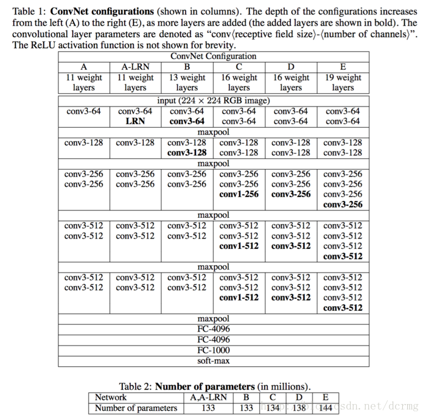
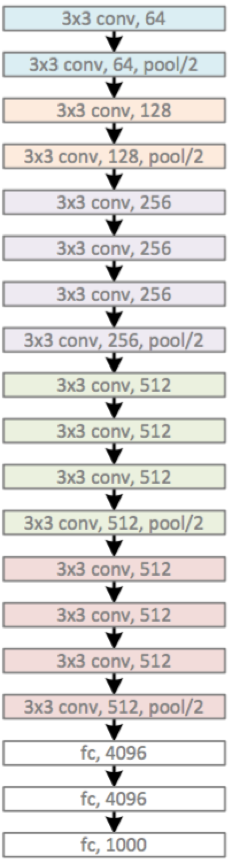
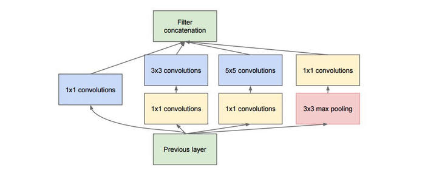
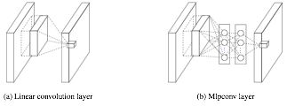
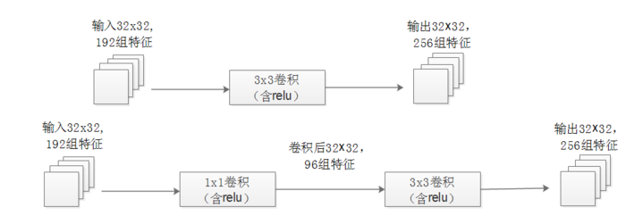
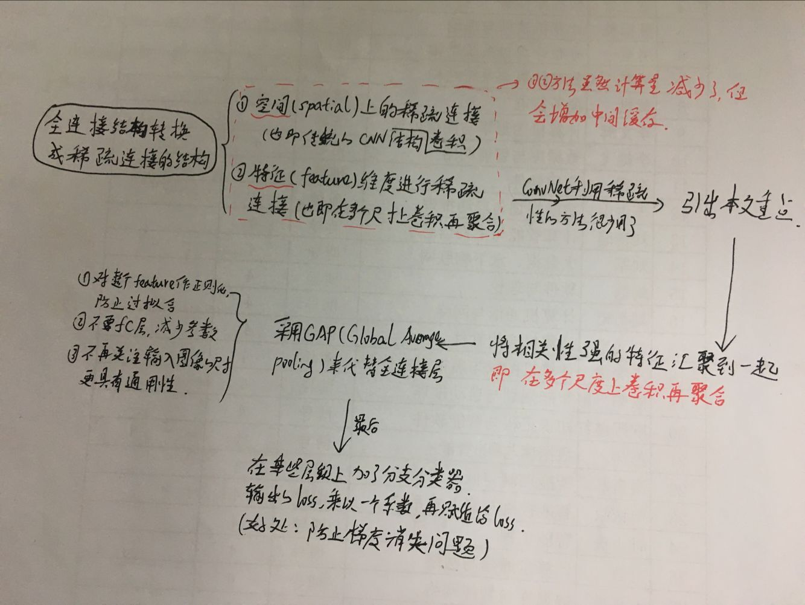
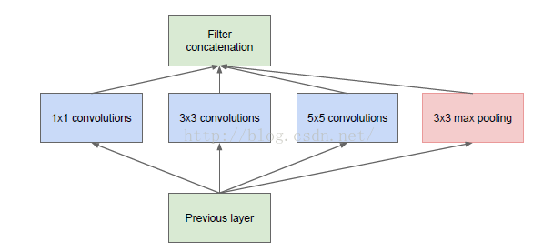
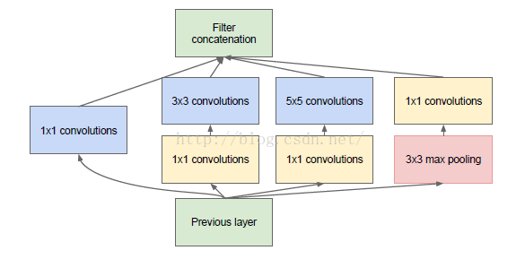
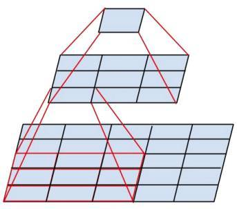
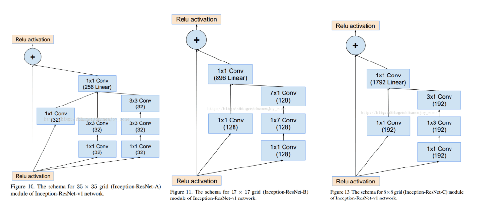

### VGGNet网络结构

**Very Deep Convolutional Networks for Large-Scale Image Recognition**

---
本文的其余部分组织如下：在第2节，我们描述了我们的ConvNet配置。图像分类训练和评估的细节在第3节，并在第4节中在ILSVRC分类任务上对配置进行了比较。第5节总结了论文。为了完整起见，我们还将在附录A中描述和评估我们的ILSVRC-2014目标定位系统。

VGGNet网络获得了2014年ImageNet亚军。VGG实在AlexNet网络结构的基础上改进得来的。它的主要贡献是展示出网络的`深度`是算法优良性能的关键部分.

VGGNet网络结构**优势**：（包括16和19两种卷积/全连接层）
- 降低了卷积核的尺寸，增加了卷积的层数
- 网络的结构非常一致，从头到尾全部使用的是3x3的卷积和2x2的pooling

VGGNet网络结构**劣势**：
- 使用了较多的层数，导致占用的 内存资源过多，不利于反向传播，耗时。~~其中绝大多数的参数都来自于第一个全连接层，后来发现这些全连接层 即使被去除，对于性能也没有什么影响，这样就显著降低了参数数量~~

**ConvNet配置**

VGG网络结构如下所示：  

VGG16包含16层，VGG19包含19层。`一系列的VGG在最后三层的全连接层上完全一样，整体结构上 都包含5组卷积层，卷积层之后跟一个MAxPool，所不同的是5组卷积层中包含的级联的卷积层越来越多`

> 引入cs231n上面一段话：
>> 几个小滤波器卷积层的组合比一个大滤波器卷积层好：
假设你一层一层地重叠了3个3x3的卷积层（层与层之间有非线性激活函数）。在这个排列下，第一个卷积层中的每个神经元都对输入数据体有一个3x3的视野。
第二个卷积层上的神经元对第一个卷积层有一个3x3的视野，也就是对输入数据体有5x5的视野。同样，在第三个卷积层上的神经元对第二个卷积层有3x3的视野，
也就是对输入数据体有7x7的视野。假设不采用这3个3x3的卷积层，二是使用一个单独的有7x7的感受野的卷积层，那么所有神经元的感受野也是7x7，但是就有一些**缺点**。  
首先，多个卷积层与非线性的激活层交替的结构，比单一卷积层的结构更能提取出深层的更好的特征。其次，假设所有的数据有C个通道，那么单独的7x7卷积层将会包含
7*7*C=49C个参数，而3个3x3的卷积层的组合仅有个3*（3 * 3*C）=27C个参数。直观说来，最好选择带有小滤波器的卷积层组合，而不是用一个带有大的滤波器的卷积层。前者可以表达出输入数据中更多个强力特征，
使用的参数也更少。唯一的不足是，在进行反向传播时，中间的卷积层可能会导致占用更多的内存。

1x1 filter: 作用是在不影响输入输出维数的情况下，对输入线进行线性形变，然后通过Relu进行非线性处理，增加网络的非线性表达能力。

Pooling：2*2，间隔s=2。

下面是VGG19的结构：

#### 结论

虽然网络层数加深，但VGG在训练的过程中比AlexNet收敛的要快一些，主要因为：
- 使用小卷积核和更深的网络进行的正则化；
- 在特定的层使用了预训练得到的数据进行参数的初始化。对于较浅的网络，如网络A，可以直接使用随机数进行随机初始化，而对于比较深的网络，则使用前面已经训练好的较浅的网络中的参数值对其前几层的卷积层和最后的全连接层进行初始化。

**VGGNet改进点总结**
- 使用了更小的3*3卷积核，和更深的网络。两个3*3卷积核的堆叠相对于5*5卷积核的视野，三个3*3卷积核的堆叠相当于7*7卷积核的视野。这样一方面可以有更少的参数（3个堆叠的3*3结构只有7*7结构参数数量的(3*3*3)/(7*7)=55%）；另一方面拥有更多的非线性变换，增加了CNN对特征的学习能力。
- 在VGGNet的卷积结构中，引入1*1的卷积核，在不影响输入输出维度的情况下，引入非线性变换，增加网络的表达能力，降低计算量。
- 训练时，先训练级别简单（层数较浅）的VGGNet的A级网络，然后使用A网络的权重来初始化后面的复杂模型，加快训练的收敛速度。
- 采用了Multi-Scale的方法来训练和预测。可以增加训练的数据量，防止模型过拟合，提升预测准确率

***

### GoogLeNet网络结构
<!--参考链接：https://blog.csdn.net/docrazy5351/article/details/78993269
 https://blog.csdn.net/diamonjoy_zone/article/details/70576775#  -->

GoogLeNet也称inception 是2014年Christian Szegedy提出的一种全新的深度学习结构。在这之前AlexNet、VGG等结构都是通过 调整网络结构，增加网络深度来回去更好的训练效果，但是 层数的增加会带来一些副作用，比如：过拟合、梯度消失、梯度爆炸等。GoogleNet的提出则是从另一角度来提升训练 结果：能更高效的利用计算资源，在相同计算量下能提取到更多的特征，从而提升训练结果。

GoogLeNet包含Inception（V1--V4）共计4个版本， 以下就详细讲解网络结构

#### 网络架构

inception模块的基本机构如下图，整个inception结构就是由多个这样的inception模块串联起来的。inception结构的主要贡献有两个：一是使用1x1的卷积来进行升降维；二是在多个尺寸上同时进行卷积再聚合。

图1： inception模块

> 1 x 1 卷积
>> 可以看到图1中有多个黄色的1x1卷积模块，这样的卷积有什么用处呢？ 
**作用1**：在相同尺寸的感受野中叠加更多的卷积，能提取到更丰富的特征。这个观点来自于Network in Network(NIN, https://arxiv.org/pdf/1312.4400.pdf)，图1里三个1x1卷积都起到了该作用。 

图2:线性卷积和NIN结构对比

图2左侧是是传统的卷积层结构（线性卷积），在一个尺度上只有一次卷积；右图是Network in Network结构（NIN结构），先进行一次普通的卷积（比如3x3），紧跟再进行一次1x1的卷积，对于某个像素点来说1x1卷积等效于该像素点在所有特征上进行一次全连接的计算，所以右侧图的1x1卷积画成了全连接层的形式，需要注意的是NIN结构中无论是第一个3x3卷积还是新增的1x1卷积，后面都紧跟着激活函数（比如relu）。将两个卷积串联，就能组合出更多的非线性特征。举个例子，假设第1个3x3卷积＋激活函数近似于f1(x)=ax^2+bx+c，第二个1x1卷积＋激活函数近似于f2(x)=mx2+nx+q，那f1(x)和f2(f1(x))比哪个非线性更强，更能模拟非线性的特征？答案是显而易见的。NIN的结构和传统的神经网络中多层的结构有些类似，后者的多层是跨越了不同尺寸的感受野（通过层与层中间加pool层），从而在更高尺度上提取出特征；NIN结构是在同一个尺度上的多层（中间没有pool层），从而在相同的感受野范围能提取更强的非线性。

**作用2**：使用1x1卷积进行降维，降低了计算复杂度。图3所示。当某个卷积层输入的特征数较多，对这个输入进行卷积运算将产生巨大的计算量；如果对输入先进行降维，减少特征数后再做卷积计算量就会显著减少。下图是优化前后两种方案的乘法次数比较，同样是输入一组有192个特征、32x32大小，输出256组特征的数据，第一张图直接用3x3卷积实现，需要192x256x3x3x32x32=452984832次乘法；第二张图先用1x1的卷积降到96个特征，再用3x3卷积恢复出256组特征，需要192x96x1x1x32x32+96x256x3x3x32x32=245366784次乘法，使用1x1卷积降维的方法节省了一半的计算量。有人会问，用1x1卷积降到96个特征后特征数不就减少了么，会影响最后训练的效果么？答案是否定的，只要最后输出的特征数不变（256组），中间的降维类似于压缩的效果，并不影响最终训练的结果。

 图3：增加了1X1卷积后降低了计算量

> 多个尺寸上进行卷积在聚合
>> 图1可以看到对输入做了4个分支，分别用不同尺寸的filter进行卷积或池化，最后再在特征维度上拼接到一起。这种全新的结构有什么好处呢？Szegedy从多个角度进行了解释：

**解释1**：在直观感觉上在多个尺度上同时进行卷积，能提取到不同尺度的特征。特征更为丰富也意味着最后分类判断时更加准确。

**解释2**：利用稀疏矩阵分解成密集矩阵计算的原理来加快收敛速度。

举个例子下图左侧是个稀疏矩阵（很多元素都为0，不均匀分布在矩阵中），和一个2x2的矩阵进行卷积，需要对稀疏矩阵中的每一个元素进行计算；如果像右图那样把稀疏矩阵分解成2个子密集矩阵，再和2x2矩阵进行卷积，稀疏矩阵中0较多的区域就可以不用计算，计算量就大大降低。这个原理应用到inception上就是要在特征维度上进行分解！传统的卷积层的输入数据只和一种尺度（比如3x3）的卷积核进行卷积，输出固定维度（比如256个特征）的数据，所有256个输出特征基本上是均匀分布在3x3尺度范围上，这可以理解成输出了一个稀疏分布的特征集；而inception模块在多个尺度上提取特征（比如1x1，3x3，5x5），输出的256个特征就不再是均匀分布，而是相关性强的特征聚集在一起（比如1x1的的96个特征聚集在一起，3x3的96个特征聚集在一起，5x5的64个特征聚集在一起），这可以理解成**多个密集分布的子特征集。这样的特征集中因为相关性较强的特征聚集在了一起，不相关的非关键特征就被弱化**，同样是输出256个特征，inception方法输出的特征“冗余”的信息较少。用这样的“纯”的特征集层层传递最后作为反向计算的输入，自然收敛的速度更快。

图4: 将稀疏矩阵分解成子密集矩阵来进行计算 

**解释3**：Hebbin赫布原理。Hebbin原理是神经科学上的一个理论，解释了在学习的过程中脑中的神经元所发生的变化，用一句话概括就是fire togethter, wire together。赫布认为“两个神经元或者神经元系统，如果总是同时兴奋，就会形成一种‘组合’，其中一个神经元的兴奋会促进另一个的兴奋”。比如狗看到肉会流口水，反复刺激后，脑中识别肉的神经元会和掌管唾液分泌的神经元会相互促进，“缠绕”在一起，以后再看到肉就会更快流出口水。用在inception结构中就是要把相关性强的特征汇聚到一起。这有点类似上面的解释2，把1x1，3x3，5x5的特征分开。因为训练收敛的最终目的就是要提取出独立的特征，所以预先把相关性强的特征汇聚，就能起到加速收敛的作用。

在inception模块中有一个分支使用了max pooling，作者认为pooling也能起到提取特征的作用，所以也加入模块中。注意这个pooling的stride=1，pooling后没有减少数据的尺寸。

**论文的整体脉络**

**补充**

> Inception V1

 
 Native Inception 
  
 
 Inception Module 

> Inception V2

 
 Batch Normalization 

> Inception V3

 
 将一个3´3卷积拆成1´3卷积和3´1卷积

> Inception V4

 
 结合了残差网络思想 

> Inception V1——构建了1x1、3x3、5x5的 conv 和3x3的 pooling 的分支网络，同时使用 MLPConv 和全局平均池化，扩宽卷积层网络宽度，增加了网络对尺度的适应性；

> Inception V2——提出了 Batch Normalization，代替 Dropout 和 LRN，其正则化的效果让大型卷积网络的训练速度加快很多倍，同时收敛后的分类准确率也可以得到大幅提高，同时学习 VGG 使用两个3´3的卷积核代替5´5的卷积核，在降低参数量同时提高网络学习能力；

> Inception V3——引入了 Factorization，将一个较大的二维卷积拆成两个较小的一维卷积，比如将3´3卷积拆成1´3卷积和3´1卷积，一方面节约了大量参数，加速运算并减轻了过拟合，同时增加了一层非线性扩展模型表达能力，除了在 Inception Module 中使用分支，还在分支中使用了分支（Network In Network In Network）；

> Inception V4——研究了 Inception Module 结合 Residual Connection，结合 ResNet 可以极大地加速训练，同时极大提升性能，在构建 Inception-ResNet 网络同时，还设计了一个更深更优化的 Inception v4 模型，能达到相媲美的性能。

~~2012年AlenNet8层，2014年VGG19层、GoogLeNet22层，2015年ResNet152层~~
