### ResNet 网络结构

---
一般认为神经网络的每一层分别对应于提取不同层次的特征信息，有低层，中层和高层，而网络越深的时候，提取到的不同层次的信息会越多，而不同层次间的层次信息的组合也会越多。

深度学习对于网络深度遇到的主要问题是[梯度消失和梯度爆炸](https://blog.csdn.net/qq_25737169/article/details/78847691)，传统对应的解决方案则是数据的初始化(normlized initializatiton)和（batch normlization）正则化，但是这样虽然解决了梯度的问题，深度加深了，却带来了另外的问题，就是网络性能的退化问题，深度加深了，错误率却上升了，而残差用来设计解决退化问题，其同时也解决了梯度问题，更使得网络的性能也提升了。~~Hinton提出的胶囊网络未来可能会抛弃反向传播彻底解决此问题~~

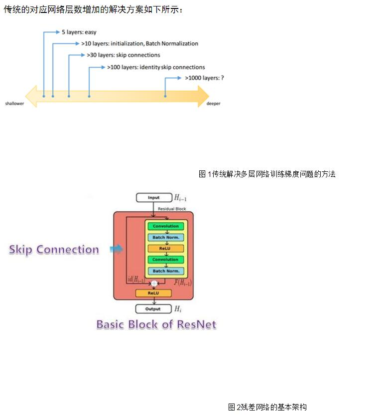

**深度残差学习**

深度残差学习，其中分为三个小部分，包括 残差元，为什么是恒等映射？ 如何快捷映射不是恒等的情况？

图3  残差网络的构思

对于普通网络，任意堆叠的两层网络，我们希望找到的是一个映射H(x)对应的残差元，我们添加一个快捷连接，从输入到输出，这里的快捷连接默认为恒等映射，此时的问题就从寻找映射H（x）到F(x)；这里类似于在数学上，你直接去解一个方程较为复杂，你就把它分解成两个简单问题和的形式，分别去解决。

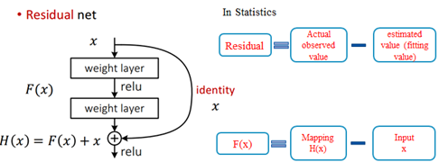
图 4 残差网络的设计统计学来源

因此，对应于残差的初始定义，在统计学中，为实际观测值与估计值（拟合值）的差值，这里则是直接的映射H(x)与快捷连接x的差值。

**残差网络**：对于残差元的主要设计有两个，快捷连接和恒等映射，快捷连接使得残差变得可能，而恒等映射使得网络变深，而恒等映射主要有两个：快捷连接为恒等映射 和 相加后的激活函数

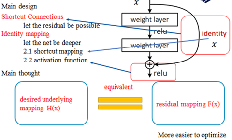
图 5 残差网络的设计构思

这样设计的主要思想：去构造映射H(x)，与构造残差映射F(x）是等价的，此外残差映射也更容易优化。

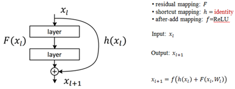  
  
这里考虑若这个激活函数也为恒等映射时，则变为下式：

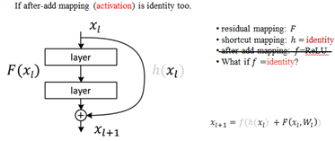
图 6 基本残差单元的介绍

若after-add后的激励函数也为恒等映射时，灰化的线，表示恒等映射了；

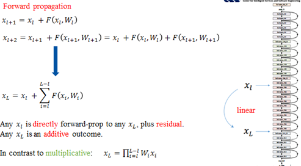
图 7残差网络的前向传播

 前向过程，最后的结果表示直接的前向过程，连加的运算（考虑的残差元为一个单元，残差元的内部还是两层的连乘），即从第l层可以直接到第L层，而传统的网络则是连乘运算，计算量明显不同。（从连乘到连加）

**普通网络和残差网络的差别**：

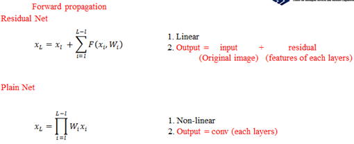

对于残差元来说，前向过程是线性的，而且后面的输入等于输入加上每一次的残差元的结果，而普通的网络，则为每一层卷积的连乘运算；

残差网络的第一大特点，反向更新解决梯度消失的问题：

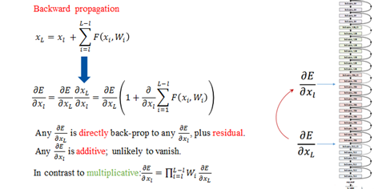

残差网络在反向传播的时候，则只求链式法则前面的部分，即从第L层的梯度可以基本上保持稳定的传递到第l层反向过程。

**残差网路和普通的网络反向传播的求导对比**：

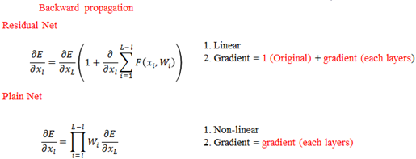

之前的正向和反向可以保证计算相对简单，主要是存在两个恒等映射。其中激活函数不为恒等映射就为普通的网络结构。快捷连接部位为恒等映射时，ReLu的使用，使得学习周期大大缩短。综合速率和效率，DL中大部分激活函数应该选择ReLu。

**下面考虑如果残差网络的快捷连接不为恒等映射的情况：**

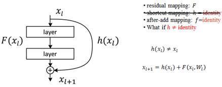

如此时英文描述的一样，h(xl)时，只要系数不为1，在对误差求导时总是会出现梯度消失或者梯度爆炸的问题；

**深度残差网络结构**

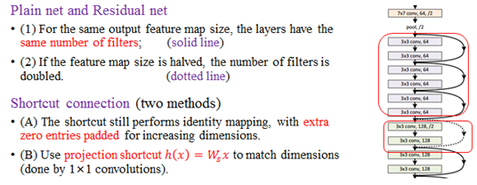
图8 深度残差网络的设计

**残差网络的设计规则：**

对于普通网络，其实对残差网络也是适用的

(1) 具有相同特征图尺度大小，具有相同个数的卷积核。对应于图8右边的网络实线区域

(2) 特征图的大小减半时，特征图的数目加倍。对应于图8右边的网络虚线区域

而对于虚线区域内的快捷连接，也有两种方式来解决

(1) 在周围填充0来增加维度

(2) 使用投影快捷，

事实上，除了堆叠两层的残差，作者还提出了堆叠三层的网络结构，当然不是单纯的3层的3*3，这里采用的1×1, 3×3, and 1×1 的卷积层，1×1的卷积主要是用来调节唯独的，这这种设计，进一步的简化了网络的设计，计算量变低，从而使得网络更深。

几种常见的残差单元

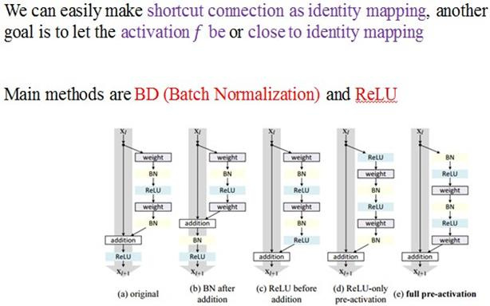
图 9 几种常见的残差单元

  
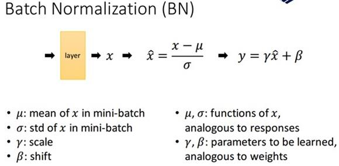
图 10 batch Normalizationd的原理

**快捷连接的多种形式：**

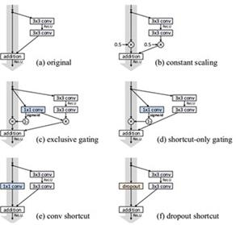

其中，B 为标量函数；C，D为门设计E，F为快捷连接为卷积和dropout

对于不同快捷连接的比较

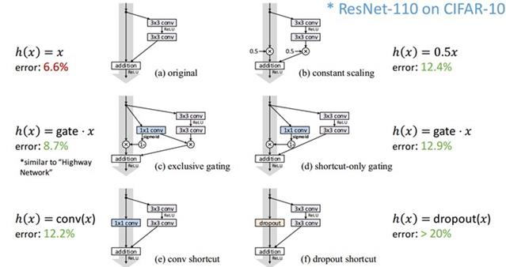

残差网络的优点：

很容易训练，值得是前向和反向都可以保证，线性使得网络加深，可以达到1000层精度提升可以被移植到其他问题。

残差网络的应用：

图像的很多问题都可以应用、视觉识别、图像生成、自然语言处理、语音识别、广告，用户预测。

附加资源代码

ImageNet models in Caffe: https://github.com/KaimingHe/deep-residual-networks

[参考文献](https://blog.csdn.net/qq_30478885/article/details/78828734)
