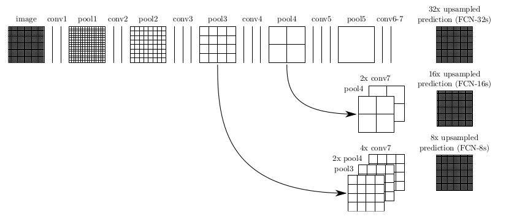
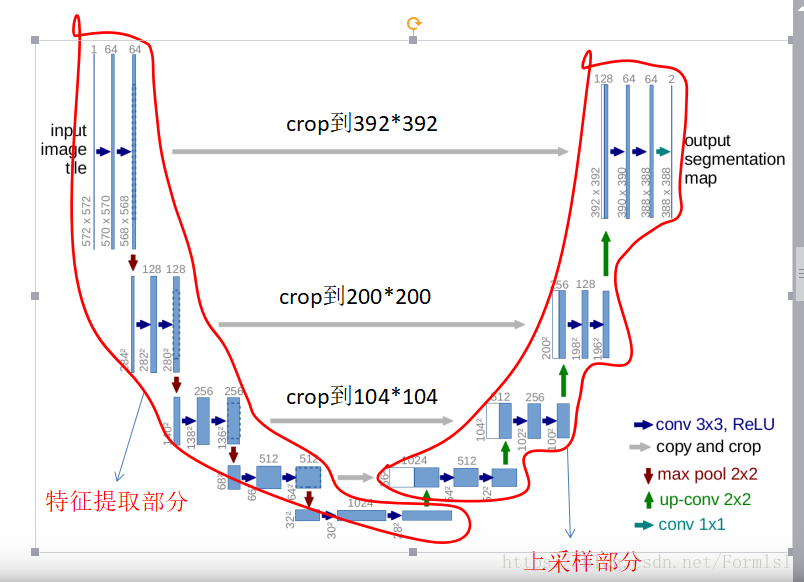

### Fully Convolutional Networks for Semantic Segmentation

**摘要**

> Convolutional networks are powerful visual models that
yield hierarchies of features. We show that convolutional
networks by themselves, trained end-to-end, pixelsto-
pixels, exceed the state-of-the-art in semantic segmentation.
Our key insight is to build “fully convolutional”
networks that take input of arbitrary size and produce
correspondingly-sized output with efficient inference and
learning. We define and detail the space of fully convolutional
networks, explain their application to spatially dense
prediction tasks, and draw connections to prior models. We
adapt contemporary classification networks (AlexNet [19],
the VGG net [31], and GoogLeNet [32]) into fully convolutional
networks and transfer their learned representations
by fine-tuning [4] to the segmentation task. We then define
a novel architecture that combines semantic information
from a deep, coarse layer with appearance information
from a shallow, fine layer to produce accurate and detailed
segmentations. Our fully convolutional network achieves
state-of-the-art segmentation of PASCAL VOC (20% relative
improvement to 62.2% mean IU on 2012), NYUDv2,
and SIFT Flow, while inference takes less than one fifth of a
second for a typical image.

***

FCN对图像进行像素级的分类，从而解决了语义级别的图像分割（semantic segmentation）问题。

FCN与CNN的区别在于把CNN最后的全连接层换成卷积层，输出的是一张已经Label好的图片。FCN可以接受任意尺寸的输入图像，采用反卷积层对最后一个卷积层的feature map进行上采样, 使它恢复到输入图像相同的尺寸，从而可以对每个像素都产生了一个预测, 同时保留了原始输入图像中的空间信息, 最后在上采样的特征图上进行逐像素分类。

**传统的CNN分割图像**

就是对图像的每一个像素点进行分类，在每一个像素点上取一个patch，当做一幅图像，输入神经网络进行训练，举个例子：比如二分类问题，把图像中所有label为0的点作为负样本，所有label为1的点作为正样本。

这种网络显然有两个缺点：

1、冗余太大，由于每个像素点都需要取一个patch，那么相邻的两个像素点的patch相似度是非常高的，这就导致了非常多的冗余，导致网络训练很慢。

2、感受野和定位精度不可兼得，当感受野选取比较大的时候，后面对应的pooling层的降维倍数就会增大，这样就会导致定位精度降低，但是如果感受野比较小，那么分类精度就会降低。

3、存储开销大。例如对每个像素使用的图像块的大小为15x15，然后不断滑动窗口，每次滑动的窗口给CNN进行判别分类，因此则所需的存储空间根据滑动窗口的次数和大小急剧上升。

**FCN分割图像**

有一个非常重要的操作就是反卷积或者叫做上采样（也就是放大图像）。~~图片不好贴，全在个人笔记文档里，编辑比较费时，暂时不传上了~~ 大致过程描述如下： 

image是原图像，conv1,conv2..,conv5为卷积操作，pool1,pool2,..pool5为pool操作（pool就是使得图片变为原图的1/2），注意con6-7是最后的卷积层，最右边一列是upsample后的end to end结果。必须说明的是图中nx是指对应的特征图上采样n倍（即变大n倍），并不是指有n个特征图，如32x upsampled 中的32x是图像只变大32倍，不是有32个上采样图像，又如2x conv7是指conv7的特征图变大2倍。

第一行对应FCN-32s，第二行对应FCN-16s，第三行对应FCN-8s。
先从FCN-32s开始说明upsample过程，只需要留意第一行，网络里面有5个pool，所以conv7的特征图是原始图像1/32，可以发现最左边image的是32x32，同时我们知道在FCN中的卷积是不会改变图像大小（或者只有少量像素的减少，特征图大小基本不会小很多），看到pool1是16x16，pool2是8x8，pool3是4x4，pool4是2x2，pool5是1x1，所以conv7对应特征图大小为1x1，然后再经过32x upsampled prediction 图片变回32x32。FCN作者在这里增加一个卷积层，卷积后的大小为输入图像的32(2^5)倍，我们简单假设这个卷积核大小也为32，这样就是需要通过反馈训练32x32个权重变量即可让图像实现end to end，完成了一个32s的upsample，FCN作者称做后卷积，他也提及可以称为反卷积。事实上在源码中卷积核的大小为64，同时没有偏置bias。还有一点就是FCN论文中最后结果都是21x…，这里的21是指FCN使用的数据集分类，总共有21类。

现在我们把1,2两行一起看，忽略32x upsampled prediction，说明FCN-16s的upsample过程，，FCN作者在conv7先进行一个2x conv7操作，其实这里也只是增加1个卷积层，这次卷积后特征图的大小为conv7的2倍，可以从pool5与2x conv7中看出来，此时2x conv7与pool4的大小是一样的，FCN作者提出对pool4与2x conv7进行一个fuse操作（事实上就是将pool4与2x conv7相加），fuse结果进行16x upsampled prediction，与FCN-32s一样，也是增加一个卷积层，卷积后的大小为输入图像的16(2^4)倍，我们知道pool4的大小是2x2，放大16倍，就是32x32，这样最后图像大小也变为原来的大小，至此完成了一个16s的upsample。现在我们可以知道，FCN中的upsample实际是通过增加卷积层，通过bp反馈的训练方法训练卷积层达到end to end，这时卷积层的作用可以看作是pool的逆过程。

这是我们看第1行与第3行，忽略32x upsampled prediction，conv7经过一次4x upsample，即使用一个卷积层，特征图输出大小为conv7的4倍，所以4x conv7的大小为4x4，然后pool4需要一次2x upsample，变成2x pool4，大小也为4x4，最后吧4x conv7，2x pool4与pool3进行fuse，得到求和后的特征图，最后增加一个卷积层，使得输出图片大小为pool3的8倍，也就是8x upsampled prediction的过程，最后也得到一个end to end的图像。同时FCN-8s均优于FCN-16s，FCN-32s。

**FCN的优缺点**
> 优点
>> FCN的最大贡献就是实现了 通过学习让图片实现 end-to-end 分类。所谓的end-to-end 就是直接输入原始数据，直接输出最终目标的一种思想。实现机器学自动学习（特征提取这一步也就融入到算法当中，不需要人来干预了）。
结合上述的FCN的全卷积与upsample，在upsample最后加上softmax，就可以对不同类别的大小概率进行估计，实现end to end。
 

> 缺点
>> - 是得到的结果还是不够精细。进行8倍上采样虽然比32倍的效果好了很多，但是上采样的结果还是比较模糊和平滑，对图像中的细节不敏感。

>> - 是对各个像素进行分类，没有充分考虑像素与像素之间的关系。忽略了在通常的基于像素分类的分割方法中使用的空间规整（spatial regularization）步骤，缺乏空间一致性。

>> - fuse操作会加上较上层的pool特征值，导致高维特征不能很好得以使用，导致FCN对图像大小变化有所要求，如果测试集的图像远大于或小于训练集的图像，FCN的效果就会变差

**references**
参考文献：https://arxiv.org/abs/1411.4038 
~~动态图参考： https://github.com/vdumoulin/conv_arithmetic~~ 
参考博客：https://blog.csdn.net/gyh_420/article/details/78570415#commentBox
https://www.cnblogs.com/gujianhan/p/6030639.html

[论文地址](https://arxiv.org/pdf/1411.4038.pdf)

### U-Net: Convolutional Networks for Biomedical Image Segmentation

**摘要**

> There is large consent that successful training of deep net-
works requires many thousand annotated training samples. In this pa-
per, we present a network and training strategy that relies on the strong
use of data augmentation to use the available annotated samples more
efficiently. The architecture consists of a contracting path to capture
context and a symmetric expanding path that enables precise localiza-
tion. We show that such a network can be trained end-to-end from very
few images and outperforms the prior best method (a sliding-window
convolutional network) on the ISBI challenge for segmentation of neu-
ronal structures in electron microscopic stacks. Using the same net-
work trained on transmitted light microscopy images (phase contrast
and DIC) we won the ISBI cell tracking challenge 2015 in these cate-
gories by a large margin. Moreover, the network is fast. Segmentation
of a 512x512 image takes less than a second on a recent GPU. The full
implementation (based on Caffe) and the trained networks are available
at http://lmb.informatik.uni-freiburg.de/people/ronneber/u-net.

***
Unet是目前比较流行的用于图像语义分割的网络，也是基于FCN之上改进的网络结构。不同之处在于Unet采用了完全不同的特征融合方式--拼接，Unet采用将特征在channel维度拼接在一起，形成更厚的特征。而FCN融合时使用的是将对应的点相加，并不形成更厚的特征。

语义分割在特征融合时常用的有两种方法：
- FCN式的对应点相加，对应于TensorFlow中的tf.add()函数；
- U-net式的channel维度拼接融合，对应于TensorFlow的tf.concat()函数，比较占显存。

**Unet网络架构**

网络结构如图所示, 蓝色代表卷积和激活函数, 灰色代表复制, 红色代表下采样, 绿色代表上采样然后在卷积, conv 1X1代表核为1X1的卷积操作, 可以看出这个网络没有全连接,只有卷积和下采样. 这也是一个端到端的图像, 即输入是一幅图像, 输出也是一副图像.

较浅的高分辨率层用来解决像素定位的问题，较深的层用来解决像素分类的问题。

卷积层： 无填充卷积+relu+（2*2，stride=2）的max pooling
卷积滤波器的数量每次下采样后double。
patch： 上采样的时候是下采样时候的两倍。因为要把下采样的patch合并过来。

优化器：SGD， 0.99的动量系数
loss： cross entropy loss function
输入：尽可能大的batch来完美使用GPU内存。
权重初始化：高斯（0，sigma=sqrt(2/N)）
图像增强采用仿射变换。

**Unet优点**

- 采用新的融合方式--拼接
- 5个pooling layer实现了网络对图像特征的多尺度特征识别。
- 上采样部分会融合特征提取部分的输出，这样做实际上是将多尺度特征融合在了一起，以最后一个上采样为例，它的特征既来自第一个卷积block的输出(同尺度特征)，也来自上采样的输出(大尺度特征)，这样的连接是贯穿整个网络的，你可以看到上图的网络中有四次融合过程，相对应的FCN网络只在最后一层进行融合。

**references**

https://blog.csdn.net/Formlsl/article/details/80373200#commentBox

[论文地址](https://arxiv.org/pdf/1505.04597.pdf)
