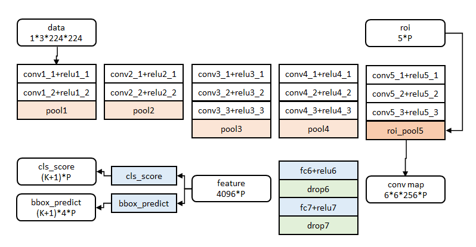
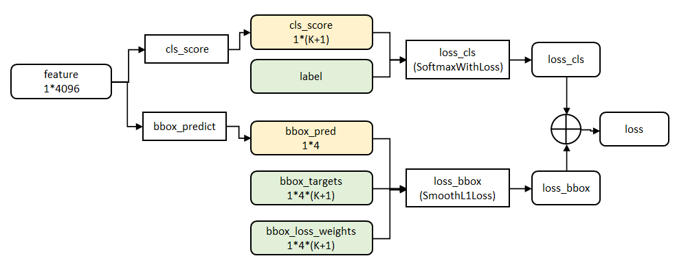

### Fast R-CNN

**摘要**

​ 本文提出了一种快速的基于Region的卷积网络方法(Fast R-CNN)用于目标检测。Fast R-CNN建立在以前使用的深卷积网络有效地分类目标proposals的成果上。相比于之前的工作，Fast R-CNN使用了很多创新，提升了训练和测试速度，同时也提高检测精度。Fast R-CNN训练非常深的VGG16网络比R-CNN快9倍，测试快213倍，并在PASCAL VOC上得到更高的精度。与SPPnet相比，Fast R-CNN训练VGG16网络比它快3倍，测试速度快10倍，并且更准确。Fast R-CNN的Python和C ++(使用Caffe)实现,以MIT开源许可证发布在: https://github.com/rbgirshick/fast-rcnn。

***

**补充知识点**

ROI

ROI(region of interest)，感兴趣区域。机器视觉、图像处理中，从被处理的图像以方框、圆、椭圆、不规则多边形等方式勾勒出需要处理的区域，称为感兴趣区域，ROI。

end-to-end

端到端指的是输入是原始数据，输出是最后的结果。细分有端到端训练和端到端模型。

参考：https://www.zhihu.com/question/51435499/answer/129379006

Spatial Pyramid Pooling]&nbsp;&nbsp;&nbsp;&nbsp;[笔记](SSPNet.md)

Spatial Pyramid Pooling 空间金字塔池化。传统CNN中的全连接层需要输入是固定大小。在图像处理中，原始图片大小不一；经过卷积后大小还是不同，这样没有办法直接接入全连接层。

**针对R-CNN现存问题，提出的改进措施**：

1、测试速度慢
RCNN 生成图像的候选区之间有大量的重叠，提取特征操作冗余。Fast-RCNN(借鉴SSPnet)则将整张图像归一化后直接送入构建的网络结构。在邻接时，才加入候选信息，在末尾少数几层处理每个候选框。

2、训练速度慢
Fast-RCNN采用将整张图片送入网络，而不是向RCNN先生成候选区在送入。紧接着送入这副图像上提取出的候选区域。这些候选区域的前几层特征不需要在重复计算

3、训练所需空间大
RCNN中 独立的分类器SVM和回归器需要大量特征作为训练样本。
而Fast-RCNN把分类器和回归器统一用 该网路结构实现，不需要在额外存储

Fast-RCNN网络结构如下所示：

分类与位置调整

第五阶段的特征输入到两个并行的全连接层中（称为muti-task）

cls_score层用于分类，输出K+1维数组pp，表示属于K类和背景的概率。  
bbox_prdict层用于调整候选区域位置，输出4*K维数组tt，表示分别属于K类时，应该平移缩放的参数。

**实验与结论**

实验过程不再详述，只记录结论
- 网络末端同步训练的分类和位置调整，提升准确度
- 使用多尺度的图像金字塔，性能几乎没有提高
- 倍增训练数据，能够有2%-3%的准确度提升
- 网络直接输出各类概率(softmax)，比SVM分类器性能略好
- 更多候选窗不能提升性能

***
参考链接：[论文地址](https://arxiv.org/pdf/1504.08083.pdf)     

原文：https://blog.csdn.net/shenxiaolu1984/article/details/51036677

SVD参考：https://www.cnblogs.com/pinard/p/6251584.html
