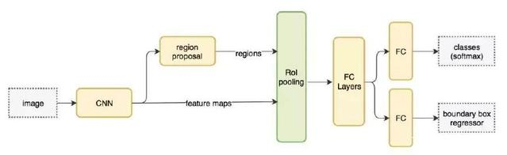
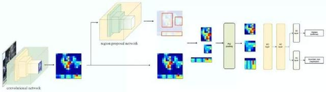

### Faster R-CNN: Towards Real-Time Object Detection with Region Proposal Networks

**摘要**

最先进的目标检测网络依靠region proposal算法来假设目标的位置。SPPnet[1]和Fast R-CNN[2]等进展已经减少了这些检测网络的运行时间，暴露region proposal计算成为一个瓶颈。在这项工作中，我们引入了一个region proposal网络(RPN)，该网络与检测网络 共享整个图像的卷积特征，从而使近乎零成本的region proposals成为可能。RPN是一个全卷积网络，可以同时在每个位置预测目标边界和目标分数。RPN通过端到端的训练，可以生成高质量的region proposals，由Fast R-CNN用于检测。我们将RPN和Fast R-CNN通过共享卷积特征进一步合并为一个单一的网络——使用最近流行的神经网络术语**“注意力”机制**，RPN组件告诉统一的网络看哪里。对于非常深的VGG-16模型[3]，我们的检测系统在GPU上的帧率为5fps(包括所有步骤)，同时在PASCAL VOC 2007，2012和MS COCO数据集上实现了state-of-the-art的目标检测精度，每个图像只有300个proposal。在ILSVRC和COCO 2015竞赛中，Faster R-CNN和RPN在多个比赛中获得第一名的记录。代码可公开获得。

---
**相当于RPNs + Fast R-CNN的组合系统**

Faster R-CNN这篇论文着重解决了这个系统中的三个问题：
- 如何设计区域生成网络；
- 如何训练区域生成网络；
- 如何让区域生成网络和Fast RCNN网络共享特征提取网络。

Faster R-CNN 采用与 Fast R-CNN 相同的设计，只是它用内部深层网络代替了候选区域方法。新的候选区域网络（RPN）在生成 ROI 时效率更高，并且以每幅图像 10 毫秒的速度运行。

Faster R-CNN 的流程图与 Fast R-CNN 相同。

外部候选区域方法代替了内部深层网络。

***
#### 补充知识点

**超像素**

在图像中由一系列位置相邻且颜色、亮度、纹理等特征相似的像素点组成的小区域，这些小区域大多保留了进一步进行图像分割的有效信息，且一般不会破坏图像中物体的边界信息。

**RPN**

候选区域网络（RPN）将第一个卷积网络的输出特征图作为输入。它在特征图上滑动一个 3×3 的卷积核，以使用卷积网络（如下所示的 ZF 网络）构建与类别无关的候选区域。其他深度网络（如 VGG 或 ResNet）可用于更全面的特征提取，但这需要以速度为代价。ZF 网络最后会输出 256 个值，它们将馈送到两个独立的全连接层，以预测边界框和两个 objectness 分数，这两个 objectness 分数度量了边界框是否包含目标。我们其实可以使用回归器计算单个 objectness 分数，但为简洁起见，Faster R-CNN 使用只有两个类别的分类器：即带有目标的类别和不带有目标的类别。

----
论文传送门：[paper](https://arxiv.org/pdf/1506.01497.pdf)

参考资料：https://baijiahao.baidu.com/s?id=1598999301741831102&wfr=spider&for=pc
