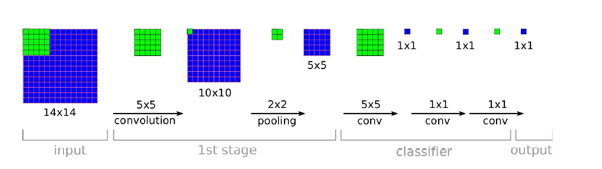
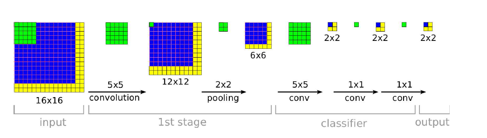
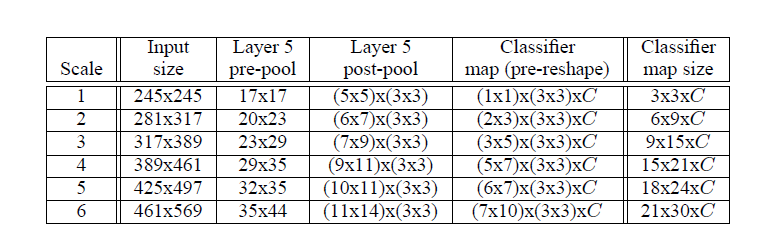
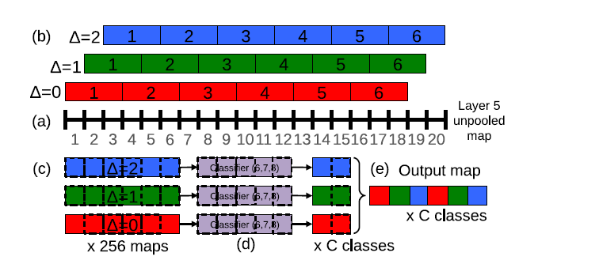

### OverFeat:Integrated Recognition, Localization and Detection using Convolutional Networks

**摘要**

>We present an integrated framework for using Convolutional Networks for classification,
localization and detection. We show how amultiscale and sliding window
approach can be efficiently implemented within a ConvNet. We also introduce a
novel deep learning approach to localization by learning to predict object boundaries.
Bounding boxes are then accumulated rather than suppressed in order to
increase detection confidence. We show that different tasks can be learned simultaneously
using a single shared network. This integrated framework is the winner
of the localization task of the ImageNet Large Scale Visual Recognition Challenge
2013 (ILSVRC2013) and obtained very competitive results for the detection and
classifications tasks. In post-competition work, we establish a new state of the art
for the detection task. Finally, we release a feature extractor from our best model
called OverFeat.

---
 简单的来讲，OverFeat将图片分类、定位、检测放在一起训练完成，相当于SIFT、HOG等这些算子。

网络的架构与AlexNet基本相同。训练阶段与AlexNet相同，但是测试阶段差别很大，这也是paper的最大亮点！

滑动窗口方法基本都是在网络测试时使用，不在网络的训练过程中使用。因为在监督学习时，如果使用滑动窗口进行网络的训练的话，每个窗口都要对应一个label吧，但是窗口没有align（对齐）目标的话，你想给什么样的label呢？

#### 预备知识

**FCN（全连接层）**

1、把卷积层--》全连接层  看成是对一整张图片的卷积层运算

2、把全连接层--》全连接层，看成是采用1*1大小的卷积核，进行卷积运算

如上图所示，上面图中绿色部分表示：卷积核大小。假设我们设计了一个CNN模型，输入图片大小是14*14，通过第一层卷积后我们得到10*10大小的图片，然后接着通过池化得到了5*5大小的图片。OK，关键部分来了，接着要从：5*5大小的图片-》1*1大小的图片：

（1）传统的CNN：如果从以前的角度进行理解的话，那么这个过程就是全连接层，我们会把这个5*5大小的图片，展平成为一个一维的向量，进行计算(写cnn代码的时候，这个时候经常会在这里加一个flatten函数，就是为了展平成一维向量)。

（2）FCN：FCN并不是把5*5的图片展平成一维向量，再进行计算，而是直接采用5*5的卷积核，对一整张图片进行卷积运算。

其实这两个本质上是相同的，只是角度不同，FCN把这个过程当成了对一整张特征图进行卷积，同样，后面的全连接层也是把它当做是以1*1大小的卷积核进行卷积运算。

从上面的例子中，我们看到网络的输入是一张14*14大小的图片，这个时候加入我就用上面的网络，输入一张任意大小的图片，比如16*16大小的图片，那么会是什么样的结果？具体请看下面的示意图：

1. 我们输入的为16*16的大小，最后输出的为2*2的大小。对于对于原始图像的左上角的14*14的大小看作窗口输入时，这个窗口的最后输出为2*2output的左上角那里。当我们对原始图像的右上角的14*14的大小看作窗口输入时，这个窗口的最后输出为2*2output的右上角那里（图上没有表示出来）…………。看到了吧，这个卷积网络一下子就可以把所有可能的窗口的输出都计算出来了,方法高效， 原因就是在重叠的窗口上的数据不用重复计算。

2. 上面的例子也是为了让我们好明白简化了一下过程（或着说理想的过程），在实际中，可能由于zero-padding的原因，仅仅会影响部分计算过程中的边缘的数据而已（单独测试窗口的输入时会补0，而用fully-convnet 同时运算时，会补相邻的像素值）

3. 分辩率的问题：上面的分辨率为 2，因为pooling的步长为2哦。。当在原始图像中的窗口平移2个像素值时，就会对应一个 output.   在文章的精确版本中分辨率为2*3*2*3＝36.

overfeat就是把采用FCN的思想把全连接层看成了卷积层，让我们在网络测试阶段可以输入任意大小的图片。

**offset max-pooling**

以往的CNN中，一般我们只用了△=0，得到池化结果后，就送入了下一层。于是文献的方法是，把上面的△=0、△=1、△=2的三种组合方式的池化结果，分别送入网络的下一层。这样的话，我们网络在最后输出的时候，就会出现3种预测结果了。（对每个类别的3中概率，取其最大值，作为此类别的预测概率值）。

Overfeat算法：训练完上面所说的网络之后，在测试阶段，我们不再是用一张221*221大小的图片了作为网络的输入，而是用了6张大小都不相同的图片，也就是所谓的多尺度输入预测，如下表格所示：

然后当网络前向传导到layer 5的时候，就使出了前面我们所讲的FCN、offset pooling这两招相结合的招式。在这里我们以输入一张图片为例(6张图片的计算方法都相同)，讲解layer 5后面的整体过程，具体流程示意图如下：

从layer-5 pre-pool到layer-5 post-pool：这一步的实现是通过池化大小为(3,3)进行池化，然后△x=0、1、2,△y=0、1、2，这样我们可以得到对于每一张特征图，我们都可以得到9幅池化结果图。以上面表格中的sacle1为例，layer-5 pre-pool大小是17*17，经过池化后，大小就是5*5，然后有3*3张结果图(不同offset得到的结果)。

从layer-5 post-pool到classifier map(pre-reshape)：我们知道在训练的时候，从卷积层到全连接层，输入的大小是4096*(5*5)，然后进行全连接，得到4096*(1*1)。但是我们现在输入的是各种不同大小的图片，因此接着就采用FCN的招式，让网络继续前向传导。我们从layer-5 post-pool到第六层的时候，如果把全连接看成是卷积，那么其实这个时候卷积核的大小为5*5，因为训练的时候，layer-5 post-pool得到的结果是5*5。因此在预测分类的时候，假设layer-5 post-pool 得到的是7*9(上面表格中的scale 3)，经过5*5的卷积核进行卷积后，那么它将得到(7-5+1)x(9-5+1)=3x5的输出。

然后我们就只需要在后面把它们拉成一维向量摆放就ok了，这样在一个尺度上，我们可以得到一个C*N个预测值矩阵，每一列就表示图片属于某一类别的概率值，然后我们求取每一列的最大值，作为本尺度的每个类别的概率值。

最后我们一共用了6种不同尺度(文献好像用了12张，另外6张是水平翻转的图片)，做了预测，然后把这六种尺度结果再做一个平均，作为最最后的结果。

**定位任务**

后面我们用于定位任务的时候，就把分类层(上面的layer 6~output)给重新设计一下，把**分类改成回归问题**，然后在各种不同尺度上训练预测物体的bounding box。

我们把用图片分类学习的特征提取层的参数固定下来，然后继续训练后面的回归层的参数，网络包含了4个输出，对应于bounding box的上左上角点和右下角点，然后损失函数采用欧式距离L2损失函数。

**简单来说：两大亮点  运用FCN思想+提出了offset max-pooling  组装**

***
获取论文点击此处：[paper](https://arxiv.org/pdf/1312.6229.pdf)

参考链接：

https://blog.csdn.net/hjimce/article/details/50187881

https://www.cnblogs.com/yinheyi/p/6232152.html
