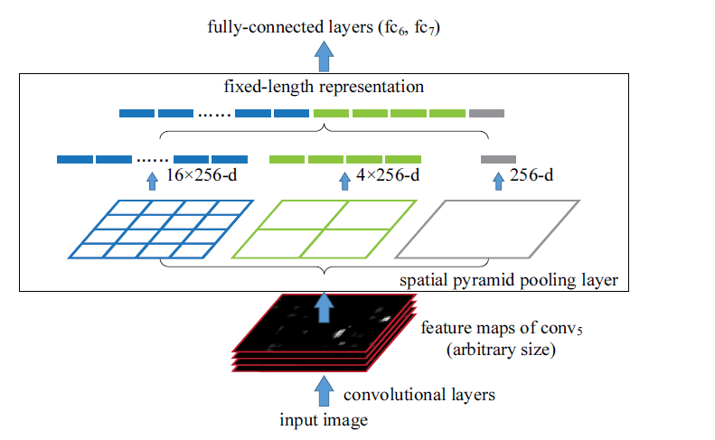
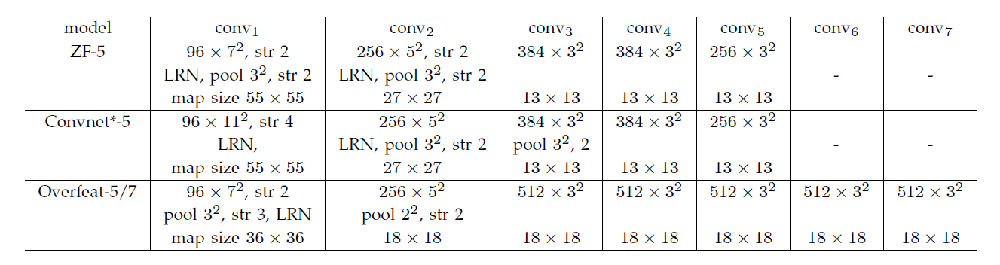
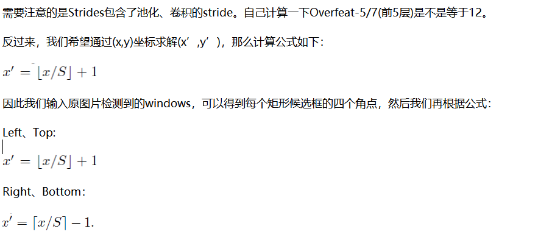

### Spatial Pyramid Pooling in Deep Convolutional Networks for Visual Recognition

**摘要**

> Abstract—Existing deep convolutional neural networks (CNNs) require a fixed-size (e.g., 224224) input image. This requirement
is “artificial” and may reduce the recognition accuracy for the images or sub-images of an arbitrary size/scale. In this
work, we equip the networks with another pooling strategy, “spatial pyramid pooling”, to eliminate the above requirement. The
new network structure, called SPP-net, can generate a fixed-length representation regardless of image size/scale. Pyramid
pooling is also robust to object deformations. With these advantages, SPP-net should in general improve all CNN-based image
classification methods. On the ImageNet 2012 dataset, we demonstrate that SPP-net boosts the accuracy of a variety of CNN
architectures despite their different designs. On the Pascal VOC 2007 and Caltech101 datasets, SPP-net achieves state-of-theart
classification results using a single full-image representation and no fine-tuning.
The power of SPP-net is also significant in object detection. Using SPP-net, we compute the feature maps from the entire
image only once, and then pool features in arbitrary regions (sub-images) to generate fixed-length representations for training
the detectors. This method avoids repeatedly computing the convolutional features. In processing test images, our method is
24-102 faster than the R-CNN method, while achieving better or comparable accuracy on Pascal VOC 2007.
In ImageNet Large Scale Visual Recognition Challenge (ILSVRC) 2014, our methods rank #2 in object detection and #3 in
image classification among all 38 teams. This manuscript also introduces the improvement made for this competition.

---
SPP：Spatial Pyramid Pooling（空间金字塔池化）------------引入空间金字塔池化改进RCNN

它的特点有两个:
- 结合空间金字塔方法实现CNNs的多尺度输入。
- 只对原图提取一次卷积特征

**motive**：输入图片的大小在经过卷积和pooling后会变（正向卷积叫做下采样，会变小，反向卷积叫做上采样，会变大），虽然对卷积过程没有影响，**但是会对全连接层的连接产生影响**。SSPNet就是为了解决此问题---如何对于不同的输入图片都可以直接运用到已经训练好的网络中去。

一般空间金子塔池化层，都是放在卷积层到全连接层之间的一个网络层。

**算法描述过程**：

输入层：一张任意大小的图片,假设其大小为(w,h)。

输出层：21个神经元。

也就是我们输入一张任意大小的特征图的时候，我们希望提取出21个特征。空间金字塔特征提取的过程如下：

如上图所示，当我们输入一张图片的时候，我们利用不同大小的刻度，对一张图片进行了划分。上面示意图中，利用了三种不同大小的刻度，对一张输入的图片进行了划分，最后总共可以得到16+4+1=21个块，我们即将从这21个块中，每个块提取出一个特征，这样刚好就是我们要提取的21维特征向量。

第一张图片,我们把一张完整的图片，分成了16个块，也就是每个块的大小就是(w/4,h/4);

第二张图片，划分了4个块，每个块的大小就是(w/2,h/2);

第三张图片，把一整张图片作为了一个块，也就是块的大小为(w,h)

空间金字塔最大池化的过程，其实就是从这21个图片块中，分别计算每个块的最大值，从而得到一个输出神经元。最后把一张任意大小的图片转换成了一个固定大小的21维特征（当然你可以设计其它维数的输出，增加金字塔的层数，或者改变划分网格的大小）。上面的三种不同刻度的划分，**每一种刻度我们称之为：金字塔的一层**，每一个图片块大小我们称之为：windows size了。如果你希望，金字塔的某一层输出n*n个特征，那么你就要用windows size大小为：(w/n,h/n)进行池化了。

**SSPNet与RCNN比较：**

R-CNN算法流程：

1、首先通过选择性搜索，对待检测的图片进行搜索出2000个候选窗口。

2、把这2k个候选窗口的图片都缩放到227*227，然后分别输入CNN中，每个候选窗台提取出一个特征向量，也就是说利用CNN进行提取特征向量。

3、把上面每个候选窗口的对应特征向量，利用SVM算法进行分类识别。

SSP-Net算法流程：

1、首先通过选择性搜索，对待检测的图片进行搜索出2000个候选窗口。这一步和R-CNN一样。

2、特征提取阶段。这一步就是和R-CNN最大的区别了，同样是用卷积神经网络进行特征提取，但是SPP-Net用的是金字塔池化。这一步骤的具体操作如下：把整张待检测的图片，输入CNN中，进行一次性特征提取，得到feature maps，然后在feature maps中找到各个候选框的区域，再对各个候选框采用金字塔空间池化，提取出固定长度的特征向量。而R-CNN输入的是每个候选框，然后在进入CNN，因为SPP-Net只需要一次对整张图片进行特征提取，速度是大大地快啊。江湖传说可一个提高100倍的速度，因为R-CNN就相当于遍历一个CNN两千次，而SPP-Net只需要遍历1次。(~~说白了，就是RCNN将图片拆成很多个候选区，交给卷积层，SSPNet将整张图片输入CNN~~)

3、最后一步也是和R-CNN一样，采用SVM算法进行特征向量分类识别。

QA:如何在feature maps中找到原始图片中候选框的对应区域？

这个答案可以在文献中的最后面附录中找到答案：APPENDIX A：Mapping a Window to Feature Maps。这个作者直接给出了一个很方便我们计算的公式：假设(x’,y’)表示特征图上的坐标点，坐标点(x,y)表示原输入图片上的点，那么它们之间有如下转换关系：
S=2*2*2*2=16

而对于Overfeat-5/7就是S=12，这个可以看一下下面的表格：

***
参考文献：https://blog.csdn.net/hjimce/article/details/50187655#commentBox
