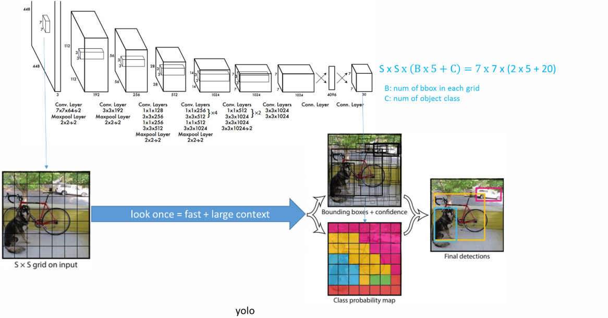
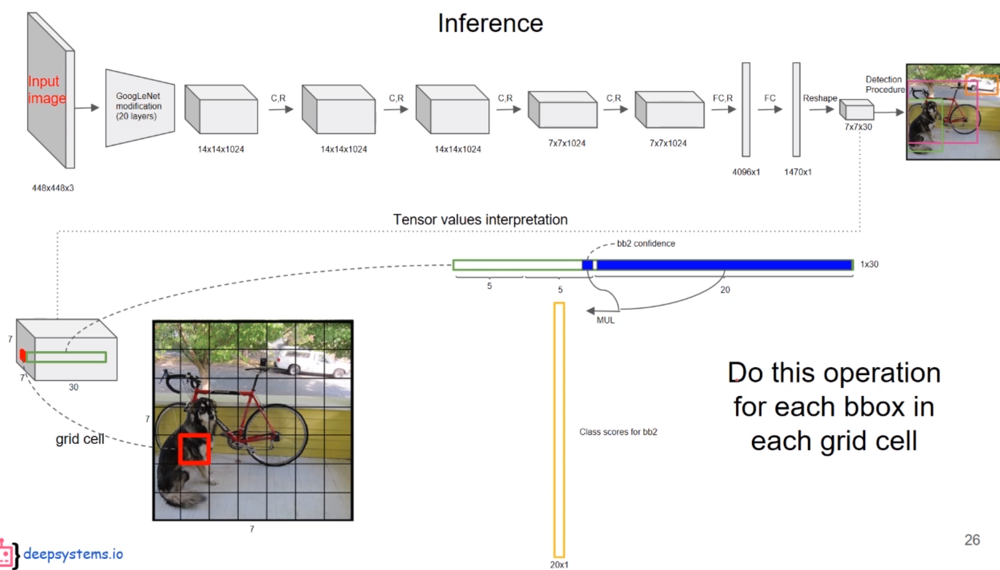
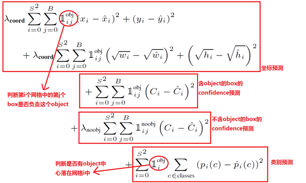
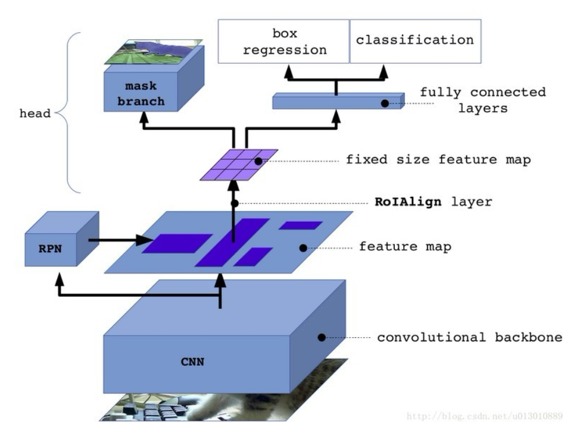
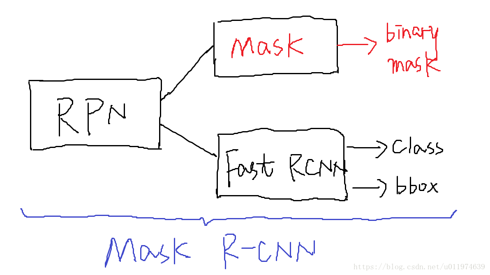
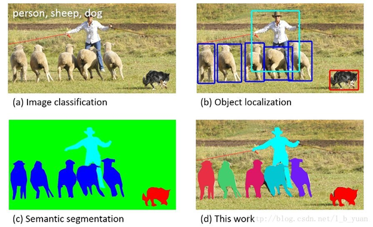

### YOLO

       本文提出了一个新的物体检测的方法：You Only Look
Once（YOLO）。之前的物体检测方法通常都转变为了一个分类问题，如 R-CNN、Fast R-CNN
等等。YOLO将检测看作一个 regression problem，YOLO 从输入的图像，仅仅经过一个
neural network，直接预测 bounding boxes 以及每个 bounding box
所属类别的概率。正因为整个的检测过程仅仅有一个网络，所以它可以直接 end-to-end
的优化。

       YOLO 结构十分的快，标准的 YOLO 版本每秒可以实时地处理 45
帧图像。一个较小版本：Fast YOLO，可以每秒处理 155 帧图像，它的 mAP（mean Average
Precision） 依然可以达到其他实时检测算法的两倍。同时相比较于其他的 state-of-art
detection systems。尽管 YOLO 的定位更容易出错，这里的 定位出错，即是指
coordinate errors。但是 YOLO 在背景预测上有更少的
false-positive(即是背景而预测为某种对象的错误情况较少)。

        最后，YOLO可以学习到物体的更加泛化的特征，在将 YOLO
用到其他领域的图像时（如 artwork 的图像上），其检测效果要优于 DPM、R-CNN
这类方法。

论文地址：<https://arxiv.org/abs/1506.02640>

参考：[论文阅读笔记：You Only Look Once: Unified, Real-Time Object
Detection](http://blog.csdn.net/tangwei2014/article/details/50915317)

**创新点**

创新点：  端到端训练及推断 + 改革区域建议框式目标检测框架 + 实施目标检测

针对简单图片检测速度快，准确率高

**缺点**

- 因为每个 grid cell 中只能预测两个 boxes，以及有一个类别。限制了YOLO对相邻物体的检测能力
- 同一类物体出现新的、不常见的长宽比时，YOLO 的泛化能力较弱。
- 对图片中过大过小的图片采取同等对待，造成误差较大。YOLO 中最主要的误差仍是定位不准造成的误差。

YOLO的核心思想就是利用整张图作为网络的输入，直接在输出层回归bounding
box的位置和bounding box所属的类别。

 a) 将一幅图像分成SxS个网格(grid cell)，如果某个object的中心
落在这个网格中，则这个网格就负责预测这个object。 

 b) 每个网格要预测B个bounding box，每个bounding
box除了要回归自身的位置之外，还要附带预测一个Confidence值。

c) Confidence代表了所预测的box中含有object的置信度和这个box预测的有多准两重信息；计算公式Confidence=$P_r(Object) * IOU^{truth}_{pred}​$; 所以在gird
cell中没有对象,那么Confidence为0；如果有对象就是与GT的IOU值。(注：Confidence代表bounding
box与任意的GT box的IOU)。

d) 每个bounding box要预测(x, y, w, h)和confidence共5个值。

e) 每个网格还要预测一个class类别信息$P_r(Class_i|Object)$；这是一个条件概率，在包含对象情况下，属于某类对象的概率。(注：class信息是针对每个网格的，confidence信息是针对每个bounding
box的）

        对于SxS个网格，每个网格要预测B个bounding
box还要预测C个categories。输出就是S x S x (5\*B+C)的一个tensor。

**YOLO的核心公式--损失函数**

    a) YOLO使用 sum-squared error 来作为优化目标，因为sum-squared error
较容易优化，但是对于本问题，直接使用 sum-squared error
却不是那么合适。主要有两个问题

-   localization error和classification error的权重一样，不是理想结果。

-   每一张图像中，很多 grid cells 并没不包含物体，使得这些 cells 的 confidence
    置为 0，这些不包含物体的 grid cells
    的梯度更新，将会以压倒性的优势，覆盖掉包含物体的 grid cells
    进行的梯度更新。这些问题会使得模型不稳定，甚至造成网络的发散。

     为了避免上述的问题，将 localization error 以及 classification error 的 loss
重新用权重衡量。以平衡上述的失衡问题。简单的说，就是增加 bounding box coordinate
的 loss，减少不包含物体 grid cells 的 confidence 的 loss；增加两个参数λcoord = 5
和λnoobj = 0.5。

      b) Sum-squared error loss 中还将 large box 与 small box 的 loss
同等对待。因为 box 与 groundtruth 的小的偏离，
对于较大的box，结果的影响较小；对小的box影响较大。为了解决这个问题，用了一个很巧妙的
trick，即最后并不是直接输出 bounding box 的 width、height，而是 width、height
的square root，平方根。

 

       c) 每个 grid cell 预测多个 bounding
box，但在网络模型的训练中，每一个物体，只想要一个 bounding box predictor
来负责预测。因此， 当前哪一个 predictor 预测的 prediction 与 groundtruth 的 IoU
最大 ，这个 predictor 就负责 predict object。因此只有在当 bounding box predictor
对 groundtruth box 负责的时候，才会对 bounding box coordinate error 进行惩罚。

        d) loss function 在只有当一个 grid cell 中存在 object 时，才会对
classification error 进行惩罚。

### Mask-RCNN

Mask R-CNN是在 Faster R-CNN 上的扩展——在其已有的用于边界框识别分支上添加了一个并行的用于预测目标掩码的分支。Mask R-CNN的训练很简单，只是在R-CNN的基础增加了少量的计算量，预测速度大约为5fps。另外，Mask R-CNN能够更好地适用于其他任务，例如：估计同一图片中人物的姿态，本文在COCO挑战中的3种任务（包括实例分割、边界框目标探测、任务关键点检测）种都获得了最好的成绩。在没有适用其他技巧的情况下，Mask R­-CNN的表现超过了现有的单个模型，包括COCO 2016挑战赛的获胜模型。本报道将会简要从提出背景、关键概念、Mask R­-CNN简介以及相关实验结果四个发面进行介绍。

Mask R-CNN就是Faster R-CNN 加上一个用于像素语义分割的FCN。

Msak RCNN整体架构

Faster RCNN整体架构

**相关知识**

1、Instance Segmentation-实例分割

instance segmentation（也称为Simultaneous Detection and Segmentation）.  它要解决的问题是检测（Object Detection）和语义分割（Semantic Segmentation）综合的一个问题。比起检测，需要得到物体更精确的边界信息；比起语义分割，需要区分不同的物体个体。上图图清楚说明了image classification, object detection, semantic segmentation, instance segmentation之间的关系。

2、Feature Pyramid Networks-特征金字塔网络

作者利用了固有的多尺度和锥形层次结构的卷积网络来构造具有边际额外成本的金字塔网络，开发具有侧向连接（Skip Connector）的自顶向下的架构，用于在所有尺度上构建高级语义特征图，依靠一种通过自上而下的路径和横向连接将低分辨率但语义强的特征与高分辨率语义弱的特征结合在一起，这样就可以获得高分辨率，强语义的特征，有利于小目标的检测。这种结构是在CNN网络中完成的，和前文提到的基于图片的金字塔结构不同，而且完全可以替代它。

### 图像难度预测器

Optimizing the Trade-off between Single-Stage and Two-Stage Object Detectors using Image Difficulty Prediction

结合YoLo与Mask RCNN建立灵活的包含两种模型的目标检测模型----图像难度预测器

主要有两种类型的最先进的物体探测器。
- 一方面，我们two-stage探测器，比如Faster R-CNN（基于区域的卷积神经网络）或Mask R-CNN，它们（i）使用区域提议网络在第一阶段产生兴趣区域， （ii）将区域提案发送到pipeline中以进行对象分类和边界框回归。这样的模型达到了最高的准确率，但通常较慢。
- 另一方面，我们有YOLO（You Only Look Once）和SSD（Singe Shot MultiBox Detector）等single-stage探测器，将物体探测作为一个简单的回归问题，它将输入图像作为输入图像并学习类概率，边界框坐标。这种模型的准确率较低，但比two-stage物体探测器快得多。

 使用图像难度预测器来实现目标检测中精度和速度之间的最佳平衡。将图像难度预测器应用到测试图像上，将其分解为简易图像和困难图像。一旦分离后，简单的图像将被发送到更快的single-stage探测器，而困难图像被发送到更精确的two-stage探测器。

 在PASCAL VOC 2007上进行的实验表明，使用图像难度与图像的随机分割相比毫不逊色。我们的方法是灵活的，因为它允许选择一个期望的阈值，将图像分成简单和较难。

**参考文献**

[YOLO](https://arxiv.org/abs/1506.02640) 
YOLO参考博客：https://blog.csdn.net/tangwei2014/article/details/50915317  
[MAsk RCNN](https://arxiv.org/pdf/1703.06870.pdf) 
