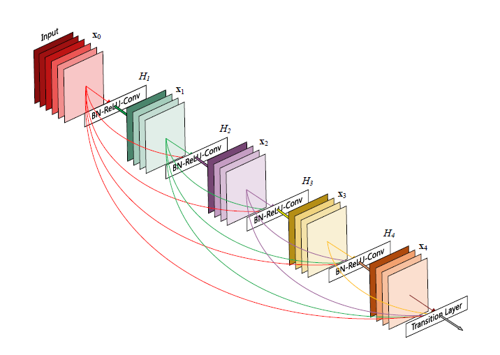
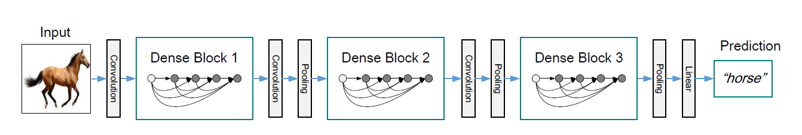
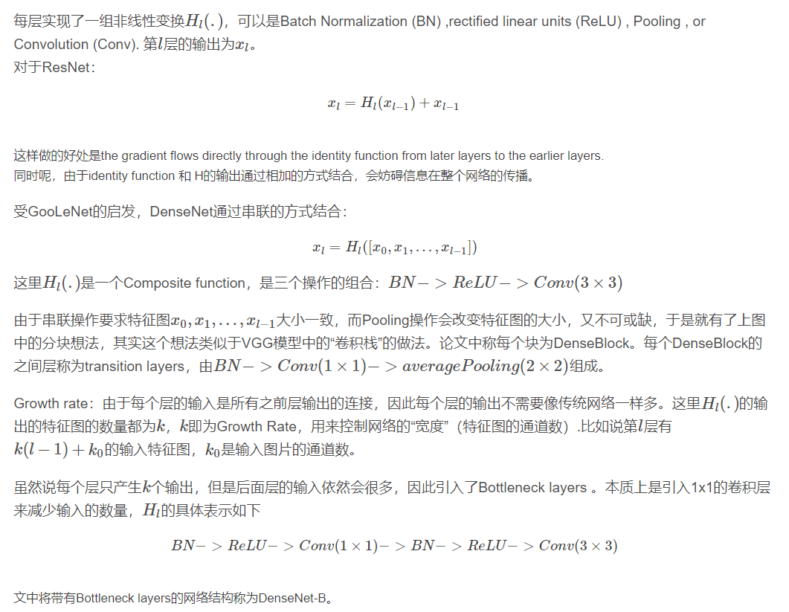
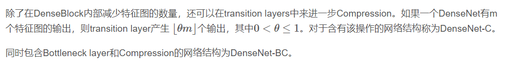

### DenseNet网络

---
论文链接：https://arxiv.org/pdf/1608.06993.pdf 
代码的github链接：https://github.com/liuzhuang13/DenseNet 
MXNet版本代码（有ImageNet预训练模型）: https://github.com/miraclewkf/DenseNet 

本文最大的创新点就是：**在保证网络中层与层之间最大程度的信息传输的前提下，直接将所有层连接起来**

paper摘要提出的DenseNet特点为：
- 减轻了梯度消失
- 加强了特征传递
- 更有效地利用了feature
- 一定程度上减少了参数数量

**DenseNet** 架构图

网络特点：
1、每一层的输入来之前一层的输出
2、前面提到过梯度消失问题在网络深度越深的时候越容易出现，原因就是输入信息和梯度信息在很多层之间传递导致的，而现在这种dense connection相当于每一层都直接连接input和loss，因此就可以减轻梯度消失现象，这样更深网络不是问题

在传统的卷积神经网络中，如果你有L层，那么就会有L个连接，但是在DenseNet中，会有L(L+1)/2个连接。*简单讲，就是每一层的输入来自前面所有层的输出*。

全文只涉及到两个数学公式，具体参见如下：

---
**总结**

 本文所用数据集： CIFAR-10，CIFAR-100，SVHN和ImageNet

 梯度下降算法：SGD

bottleneck layer： 每个dense block的3 x 3卷积前面都包含了一个1 x 1的卷积操作，就是所谓的bottleneck layer，**目的是减少输入的feature map数量，既能降维减少计算量，又能融合各个通道的特征**。即DenseNet-B

Translation layer：为了进一步压缩参数，在每两个dense block之间又增加了1*1的卷积操作。即DenseNet-C

DenseNet-BC：表示既有bottleneck layer 又有Translation layer

> 该文章提出的DenseNet核心思想在于建立了不同层之间的连接关系，充分利用了feature，进一步减轻了梯度消失问题，加深网络不是问题，而且训练效果非常好。。另外，利用bottleneck layer，Translation layer以及较小的growth rate使得网络变窄，参数减少，有效抑制了过拟合，同时计算量也减少了。DenseNet优点很多，而且在和ResNet的对比中优势还是非常明显的。

---
参考链接：https://blog.csdn.net/u014380165/article/details/75142664/
