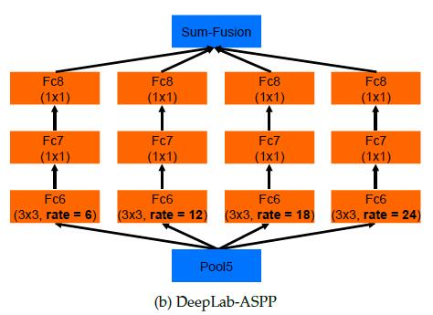
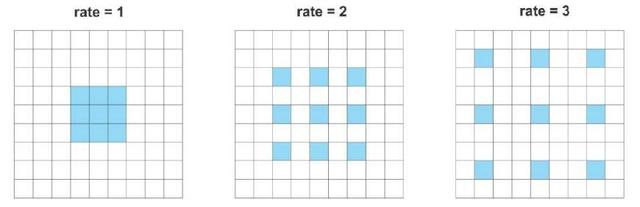

**该笔记主要讲： DeepLab语义分割 V1--V3 版本总结**

**DeepLab V1：**

V1主要解决了两个问题： 感受野（V1）的大小（feature map的尺寸） 和 空间不变性（用全连接CRF代替short range的CRF）

> 针对第一个问题：RF（感受野）大小
 >> 经过CNN提取特征后，反卷积feature map还原到原图像尺寸，可是feature map为什么会变小呢？因为stride的存在。于是DeepLab就考虑，我直接把stride改成1，feature map不就变大了吗。将stride改小，确实能得到更加dense的feature map这个是毋庸置疑的，可是却也带来了另外一个问题即receptive field（RF）的改变问题。receptive field是直接和stride挂钩的：
RFi+1 = RFi + (kernel-1)xstride (i越小越bottom)
按照公式，stride变小，要想保持receptive field不变，那么，就应该增大kernel size。于是就有了接下来的**hole算法**。当采用hole算法，在kernel里面增加“hole”，kernel size变大，相当于卷积的时候跨过stride减小额外带来的像素，RF就保持不变了，当然如果调整hole的size还能得到比原来更大的RF。
于是，通过hole算法，我们就得到了一个8s的feature map，比起FCN的32s已经dense很多了

> 针对第二个问题： 随着CNN提取feature map，图像原来的位置信息会随着深度而减少甚至消失
 >> CRF在传统图像处理上的应用就是做平滑的，也即：在决定一个位置像素时会考虑周围邻居的像素值，这样能摸除一些噪音。
一般图像通过CNN，也能做到比较“平滑”
针对这种现象，将原来的short range 的CRF替换成full connectioned CRF，这样就考虑全局信息了。
CRF是后处理，是不参与训练的，在测试的时候对feature map做完CRF后，再双线性插值resize到原图尺寸，因为feature map是8s的，所以直接放大到原图是可以接受的。

---
**DeepLab V2**

Multi-scale对performance提升很大，而我们知道，receptive field，视野域（或者感受野），是指feature map上一个点能看到的原图的区域，那么如果有多个receptive field，是不是相当于一种Multi-scale？出于这个思路，v2版本在v1的基础上增加了一个多视野域。具体看图可以很直观的理解。

注：rate也就是hole size 
这个结构作者称之为ASPP（atrous spatial pyramid pooling），基于洞的空间金字塔 
此外，DeepLab v2有两个基础网络结构，一个是基于vgg16，另外一个是基于resnet101的。

---
**DeepLab V3**

论文地址：https://arxiv.org/abs/1706.05587 

deepLabV1-v2算是启蒙，现在的deeplabv3做了很大的改进，在测试数据集上的效果非常高效，以下介绍部分V3的内容，后续还会更新

DeepLabV3改进了 **空间维度上的金字塔空洞池化方法(ASPP)，采用全局平均池化；该模块级联了多个空洞卷积结构**。与在DeepLab v2网络、空洞卷积中一样，这项研究也用空洞卷积/多空卷积来改善ResNet模型。

这篇论文还提出了三种改善ASPP的方法，涉及了像素级特征的连接、加入1×1的卷积层和三个不同比率下3×3的空洞卷积，还在每个并行卷积层之后加入了批量归一化操作。

级联模块实际上是一个残差网络模块，但其中的空洞卷积层是以不同比率构建的。这个模块与空洞卷积论文中提到的背景模块相似，但直接应用到中间特征图谱中，而不是置信图谱。置信图谱是指其通道数与类别数相同的CNN网络顶层特征图谱。

该论文独立评估了这两个所提出的模型，尝试结合将两者结合起来并没有提高实际性能。两者在验证集上的实际性能相近，带有ASPP结构的模型表现略好一些，且没有加入CRF结构。

这两种模型的性能优于DeepLabv2模型的最优值，文章中还提到性能的提高是由于加入了批量归一化层和使用了更优的方法来编码多尺度背景。

---
**相关知识点**

> CRF方法是一种基于底层图像像素强度进行“平滑”分割的图模型，在运行时会将像素强度相似的点标记为同一类别。加入条件随机场方法可以提高1~2%的最终评分值。

 >>参考：https://blog.csdn.net/caicai2526/article/details/79984950

>多尺度和多分辨率的区别
 >>最大的不同：
    尺度空间表达是由不同高斯核平滑卷积得到，在所有尺度上有相同的分辨率；
    而（金字塔）多分辨率表达每层分辨率减少固定比率。
所以，（金字塔）多分辨率生成较快，且占用存储空间少；而多尺度表达随着尺度参数的增加冗余信息也变多。
多尺度表达的优点在于图像的局部特征可以用简单的形式在不同尺度上描述；而（金字塔）多分辨的表达没有理论基础，难以分析图像局部特征。 
参考链接：https://blog.csdn.net/guyubit/article/details/52608007

>多尺度预测不如CRF效果好（论文中提到的）

> 空洞卷积
  >> 空洞卷积（或者扩张卷积）是具有一个因子的常规卷积，这个因子使得我们能够扩展滤波器的视 
以 3×3 卷积滤波器为例。当扩张因子等于 1 时，它的行为类似于标准卷积。但是，如果将扩张因子设置为 2，则它具有扩大卷积核的效果。 
理论上，它是这样工作的：首先，根据扩张率对卷积滤波器进行扩张。然后，它用零填充空白空间，创建稀疏的类似滤波器。最后，使用扩张的滤波器进行常规卷积

  >> 空洞卷积在不增加参数数量或计算量的情况下增加了更大范围的语境信息。

 >>空洞空间金字塔池化（ASPP）的思想是提供具有多尺度信息的模型。为了做到这一点，ASPP 添加了一系列具有不同扩张率的空洞卷积。这些扩张率是被设计用来捕捉大范围语境的。此外，为了增加全局的语境信息，ASPP 还通过全局平均池化（GAP）结合了图像级别的特征。

Deeplab 提供了一个传统编码器-解码器体系架构的替代方案。它提倡在多范围的语境中使用空洞卷积学习特征。
