### Encoder-Decoder with Atrous Separable Convolution for Semantic Image Segmentation

用于语义图像分割的带有可分离卷积的编码器--解码器

### 摘要

> 空间金字塔池化模块能够通过多种速率和多个有效字段探测带有池化过滤器或池化操作的传入特征来编码多尺度上下文信息。

> 编码-解码结构 通过控制 atrous convolution 来输出编码特征的分辨率，来平衡精度和运行时间(已有编码-解码结构不具有该能力.)，逐渐恢复空间信息来捕获更清晰的对象边界

> 具体来说，我们提出的模型DeepLabv3 +通过添加一个简单有效的解码器模块来扩展DeepLabv3。我们进一步探索Xception模型并将深度可分离卷积应用于空间金字塔池化和 解码器模块，产生更快更强的编码器 - 解码器网络。

> 实验效果如下：

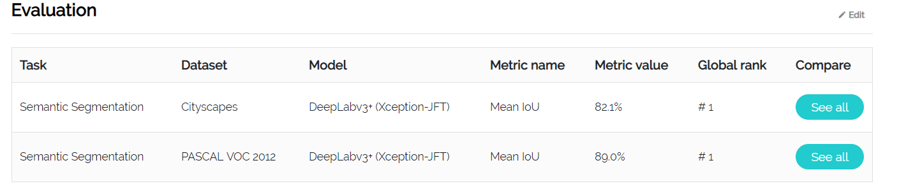

开源代码：[tensorflow-code](https://github.com/tensorflow/models/tree/master/research/deeplab)

**简介**

`空间金字塔池化模块`用来汇聚特征来捕获丰富的上下文信息，`编码解码结构`用来获取明确的物体边框

本文所作贡献如下：
- 我们提出了一种新颖的编码器 - 解码器结构，它采用DeepLabv3作为强大的编码器模块和简单而有效的解码器模块。
- 在我们的结构中，人们可以通过动态卷积任意控制提取的编码器特征的分辨率，以交换精度和运行时间，这对于现有的编码器 - 解码器模型是不可能的。
- 我们将Xception模型用于分割任务，并将深度可分离卷积应用于ASPP模块和解码器模块，从而产生更快更强的编码器 - 解码器网络。
- 我们提出的模型在PASCALVOC 2012和Cityscapes数据集上获得了新的最新表现。 我们还提供设计选择和模型变体的详细分析 (代码已开源)

#### 相关知识

深度网络最后层输出的feature map 虽然能够编码丰富的语义信息，但由于**pooling和不同步长的卷积处理，会导致物体边界信息丢失**，且计算GPU显存占用较多
编码-解码 模型编码计算速度快，且解码能够逐步重构更好的物体边界

**深度可分离卷积**

深度可分离卷积：把标准卷积分解成深度卷积和逐点卷积。这么做的好处是可以大幅度降低参数量和计算量。

基本流程如下：

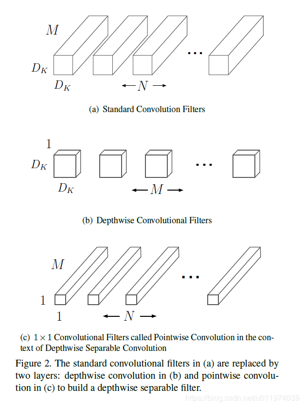

具体例子如下：

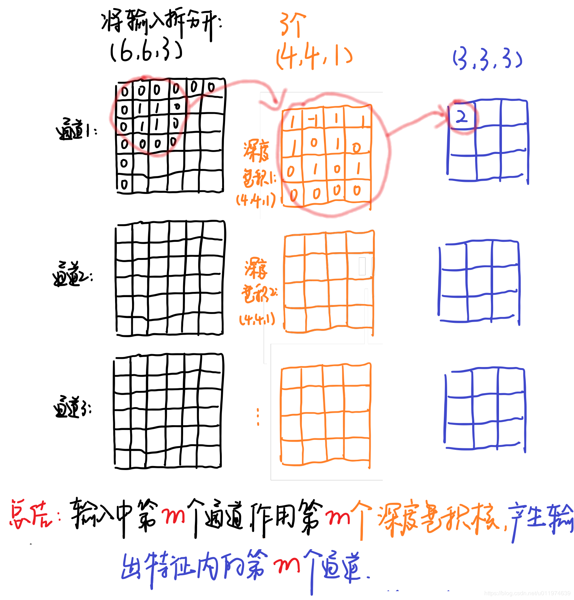

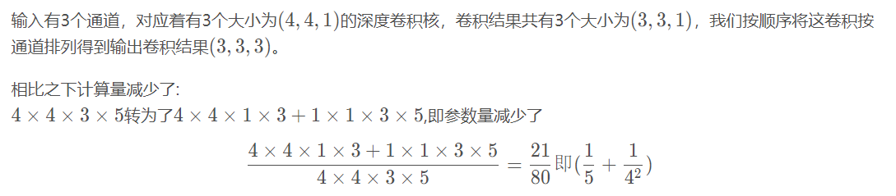

**PSPNetwork**

PSPNet网络（Pyramid Scene Parsing Network   金字塔场景解析网络）

场景识别：基于语义分割，对图像中的像素分配一个类别标签，以对场景进行理解

PSPNet 来提取合适的全部特征

- 将传统的dilated(扩张) FCN产生的像素级别特征，扩展到全局金字塔池化特征
- 结合Local和Golabl信息进行最终的预测
- 提出supervised loss的优化策略，防止梯度发散

pyramid pooling module 进行了四种不同的pyramid scale，在进行特征融合

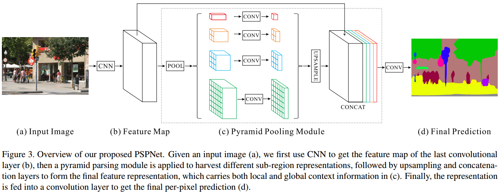

PSPNet特点：

- 能够有效的得到像素级标注的全局上下文信息，pyramid pooling module集合不同levels的信息比global pooling 具有更好的特征表示能力
- 计算代价与dilated FCN网络对比，并未增加
- End-to-end，同时对 global pyramid pooling module 和 local FCN feature 进行优化学习

**Multi-scale Context Aggregation by Dilated Convolutions**

[扩张卷积的多尺度上下文聚合](https://arxiv.org/pdf/1511.07122.pdf)

Dense Prediction 需要结合多尺度内容推理(multi-scale contextual reasoning)与 full-resolution 输出.

处理 multi-scale reasoning 与 full-resolution dense prediction 冲突的方法：

> 利用重复的 up-convolutions 操作，重构丢失的分辨率，保留downsampled 层的全局信息.

> 利用图像不同 rescaled 的信息作为网络输入，并结合其输出. 不过无法确定哪个 rescaled 输入图像是最需要的.

>Dilated Convolutions 不会降低图像分辨率，或分析 rescaled 图像，整合了多尺度的内容信息. 可以以任何分辨率加入到已有的网络结构中.

> 扩大卷积（dilated convolution）是通过跳过部分输入来使filter可以应用于大于filter本身长度的区域。等同于通过增加零来从原始filter中生成更大的filter。

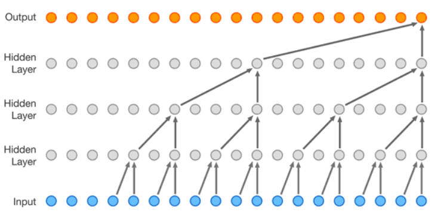

在示意图中，卷积感受野扩大了1,2,4,8倍。扩大卷积（dilated convolution）可以使模型在层数不大的情况下有非常大的感受野。

(PS：dilated convolution 与 atrous convolution类似  带孔卷积)

**Semantic Image Segmentation With Deep Convolutional Nets and Fully Connected CRFs**

[深度卷积网和全连接CRF的语义图像分割](http://www.aiuai.cn/aifarm133.html)

> 模型结构

> 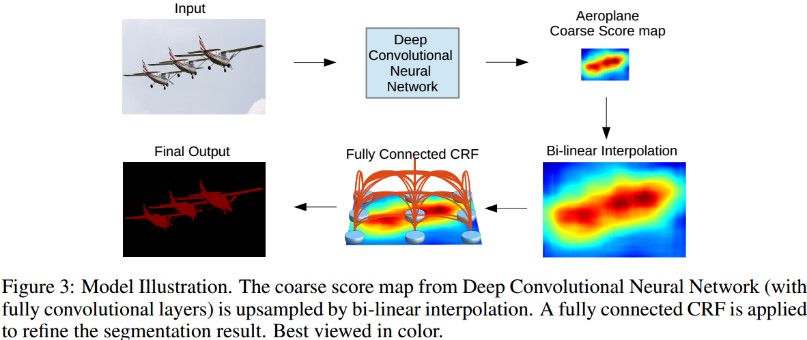

> CRF的能量函数原理如下：

> 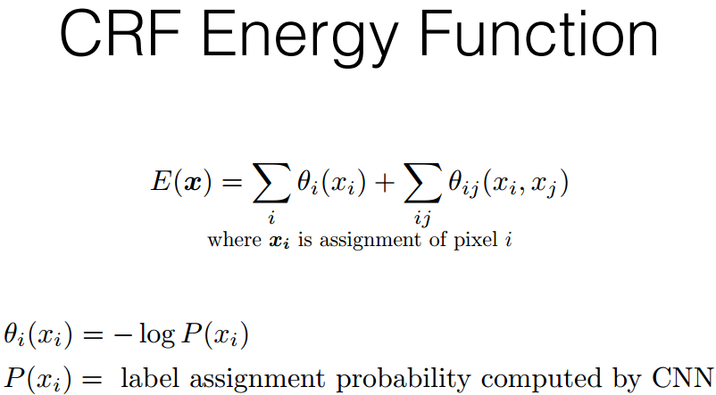
> 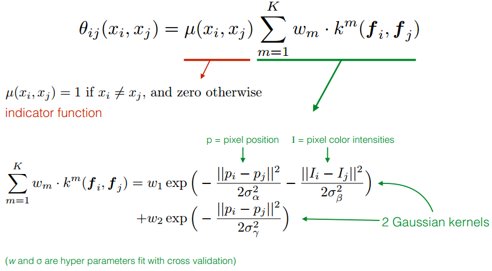
> 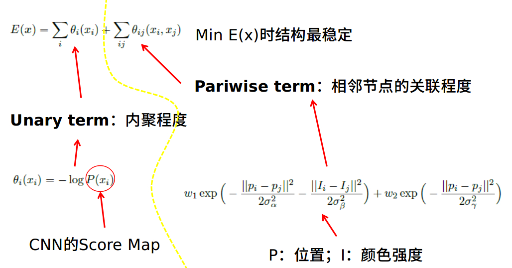

>  结论
>> 修改CNN结构以减少空间不变性 
>> 使用全连接的CRF锐化分数图

DeepLabV3+ 模型与之前的结构对比

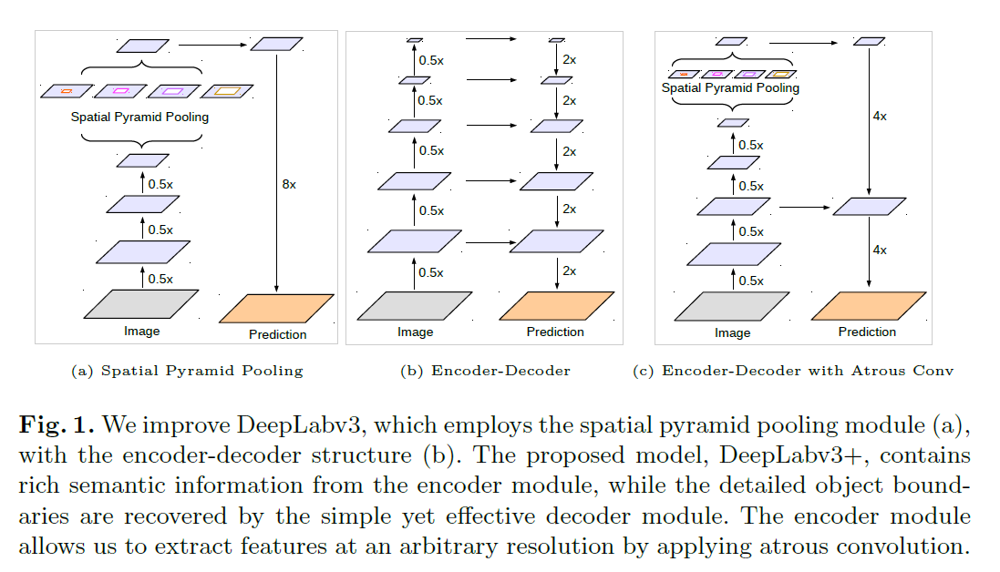

----

**相关工作**

DeepLabV3+ 采用 DeepLabv3 中编码结构，输出特征图是256 channels，包含丰富的语义信息

DeepLabV3 采用ASPP模块，带孔卷积来提取不同尺度的卷积，不同分辨率的特征

输出步长= 输入图片空间分辨率/输出分辨率

图像分类 - 最终输出 feature map 的空间分辨率一般是输入图片的 1/32，即 output_stride=32.

语义分割 - 一般为 output_stride=16 或 output_stride=8.

> DeepLabV3+ 改造的解码结构

DeepLabV3 中的对 feature map 采用因子为 16 的双线性插值(bilinearly upsampled)处理，可以看做是 naive 的解码模块，但不足以重构物体分割细节.

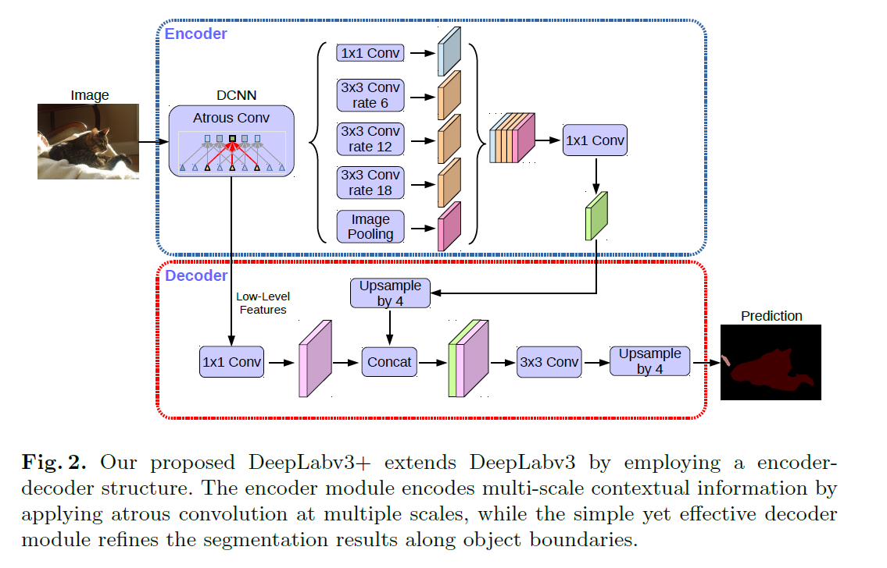

Encoder部分采用的是ASPPNet，将编码输出的特征图采用因子为4的双线性上采样，然后，连接从主干网络锁输出的对应的具有相同空间分辨率的low-level特征，由于对应的low-level特征往往包含较多的channel，可能会超过输出编码特征导致训练困难，因此在此之前加一个1*1的卷积对low-level特征进行操作，以减少channel数
连接之后还要进行3*3卷积和因子为4的双线性上采样来改善特征。

（output_stride = 16 的编码模块输出，取得了速率和精度的平衡.
output_stride = 8 的编码模块输出，精度更高，但计算复杂度增加.）

> 改进Aligned Xception

>> 相同深度Xception，没有修改entry follow network 
>> 采用卷积可分离（depthwise separable conv）来替换所有的max-pooling操作，以利用带孔可分离卷积来提取任意分辨率的特征图 
>> 在每个3*3 depthwise conv 后，添加BN和ReLU

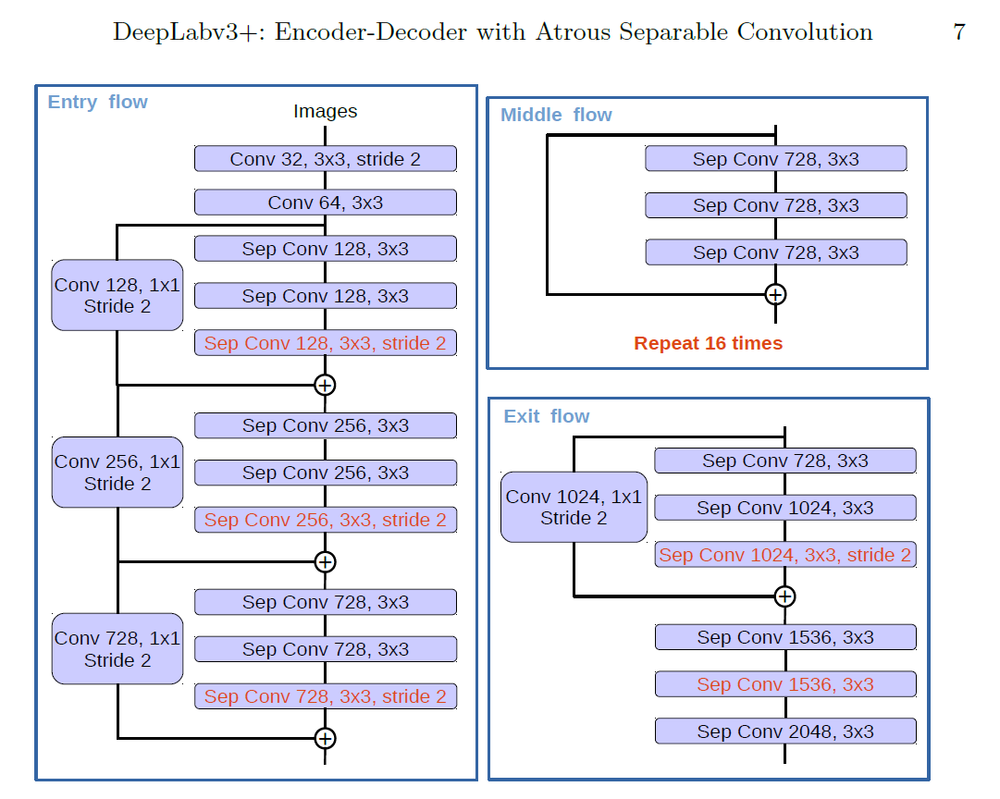

**实验**

- ResNet-101/Modified Aligned Xception - atrous conv 提取 feature maps.
- PASCAL VOC 2012 - 20 object classes 和 1 background class.
- crop_size = 513 × 513，initial_learning_rate=0.007，poly，fine-tune.
- output_stride = 16，随机裁剪数据增强.

**实验结果**

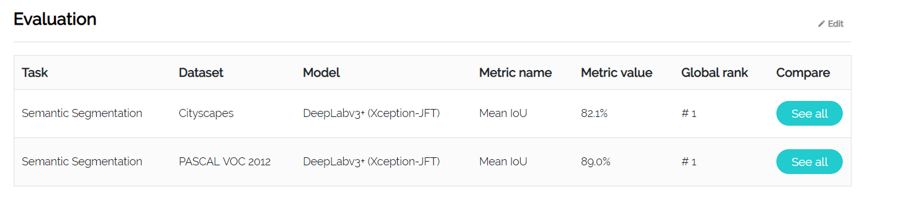

**reference**

depthwise convolution Network：https://blog.csdn.net/u011974639/article/details/79199306

DeepLabV3+: https://www.aiuai.cn/aifarm132.html  
          https://paperswithcode.com/paper/encoder-decoder-with-atrous-separable-co3
