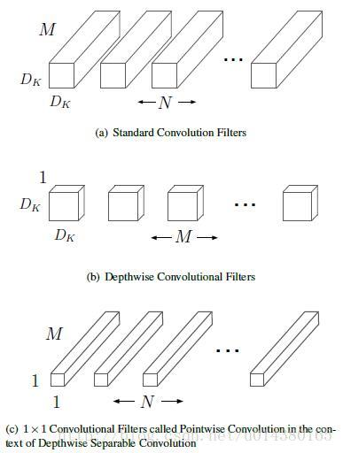
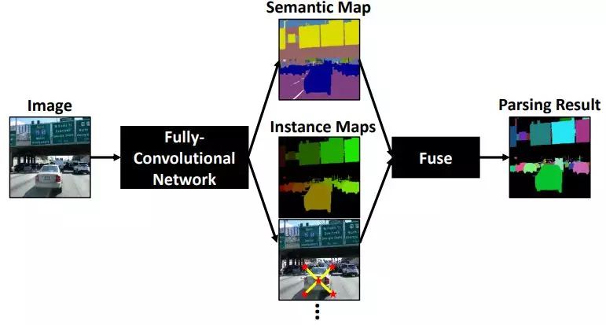
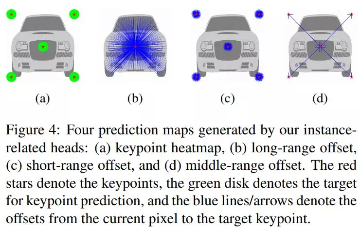
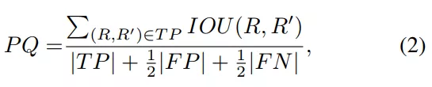
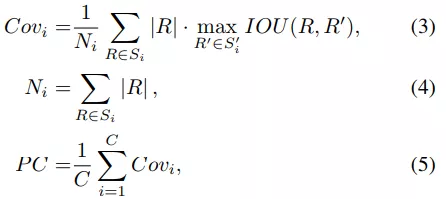

### DeeperLab: Single-Shot Image Parser

Abstract：我们提出了一种用于image parsing（图像解析）的 single-shot, bottom-up 的方法。Whole image parsing（整幅图像解析），也称为全景分割，涵盖了 “stuff” 类的语义分割任务和 “thing” 类的实例分割，为图像中的每个像素分配语义和实例标签。最近的 whole image parsing 方法通常使用单独的独立模块来进行组成语义和实例分割任务，并且需要多次推断。相反，**本文提出的DeeperLab image parser（图像解析器）使用一种非常简单的全卷积方法执行 whole image parsing，该方法以 `single-shot` 方式联合处理语义和实例分割任务，从而使得流线型系统更适合快速处理。** 对于定量评估，我们使用基于实例的全景质量（PQ）度量，并提出基于区域的分析覆盖（PC）度量，它更好地捕获 “stuff” 类和更大物体实例上的图像分析质量。我们介绍了具有挑战性的 Mapillary Vistas 数据集的实验结果，其中我们的单一模型在GPU上实现了31.95％（val）/ 31.6％PQ（测试）和55.26％PC（val），每秒3帧（fps）或接近实时速度（GPU上为22.6 fps），精度会降低。

---
** 知识点回顾 **

图像分割：根据一定的算法将图像分割为若干特定区域，并标注出感兴趣的目标

研究领域：语义分割、实例分割和全景分割（近两年刚兴起的）
> 想要理清三个子领域的区别就不得不提到关于图像分割中 things 和 stuff 的区别：图像中的内容可以按照是否有固定形状分为 things 类别和 stuff 类别，其中，人，车等有固定形状的物体属于 things 类别（可数名词通常属于 things）；天空，草地等没有固定形状的物体属于 stuff 类别（不可数名词属于 stuff）。
>> 简言之：固定形状的为thing  反之，为stuff

> 语义分割更注重「类别之间的区分」，而实例分割更注重「个体之间的区分」，全景分割可以说是语义分割和实例分割的结合

目前用于全景分割的常见公开数据集包括：MSCOCO、Vistas、ADE20K 和 Cityscapes。

`Xception`是指卷积神经网络的特征图中的跨通道相关性和空间相关性的映射可以完全脱钩。由于这种假设是Inception结构中极端化的假设，我们将它称作Xception，意指极端Inception。

卷积的操作，主要进行2种变换，

(1)spatial dimensions，空间变换

(2)channel dimension，通道变换

而Xception就是在这2个变换上做文章。Xception与Inception V3的区别如下：
> 卷积操作顺序的区别

>> Inception V3是先做1*1的卷积，再做3*3的卷积，这样就先将通道进行了合并，即通道卷积，然后再进行空间卷积，而Xception则正好相反，先进行空间的3*3卷积，再进行通道的1*1卷积。

>> 

> RELU的有无

>> 这个区别是最不一样的，Inception V3在每个module中都有RELU操作，而Xception在每个module中是没有RELU操作的

`MobileNet`模型的核心就是将原本标准的卷积操作因式分解成一个depthwise convolution和一个1*1的卷积（文中叫pointwise convolution）操作。简单讲就是将原来一个卷积层分成两个卷积层，其中前面一个卷积层的每个filter都只跟input的每个channel进行卷积，然后后面一个卷积层则负责combining，即将上一层卷积的结果进行合并。

本文的算法是用上图中的（b）+（c）代替（a）

图像解析的作用： 将图像分解为连续的视觉模式

---

**主要贡献**

1）我们为高效的 image parsers 提出了几种神经网络设计策略，特别是减少了高分辨率输入的内存占用。这些创新 **包括广泛应用 depthwise separable convolution（深度可分离卷积），使用带有简单的两层预测头的共享解码器输出，扩大 kernel 大小而不是使网络更深，采用 spaceto-depth and depth-to space 而不是上采样，并采用  hard data mining。** 还提供了详细的 ablation（消融）研究，以验证这些策略在实践中的作用。

2）我们基于提出的设计策略，提出了一种高效的 single-shot, bottom-up image parser：DeeperLab。例如，在 Mapillary Vistas 数据集上，基于Xception-71 [5,6,7]的模型实现了31.95％PQ（val）/ 31.6％（测试）和55.26％PC（val），每秒3帧（fps）在GPU上。我们的新型更广泛的基于MobileNetV2 [8]的模型可以实现接近实时的性能（GPU上为22.61 fps），当然精度会有所降低。

3）我们提出了一种新的度量标准：Parsing Covering，用于从基于区域的角度评估 image parsing 结果。

Parsing Covering 即将开源，链接：http://parsingcovering.mit.edu/

此外，我们还在补充材料中介绍了DeeperLab在其他数据集上的实验结果（Cityscapes，Pascal VOC 2012和COCO）。

**具体方法**

1 Encoder

我们已经尝试了两个基于有效深度可分离卷积的网络：标准Xception-71 ，用于更高精度，以及一个新的MobileNetV2变体：Wider MobileNetV2，用于更快的推理.

2 Decoder

Decoder 模块的目标是恢复详细的物体边界。在DeepLabV3+之后，我们采用了一种简单的设计，它将 encoder输出的 activations （步长16）与来自网络 backbone 的低级特征映射（步长4）相结合。

3 Image Parsing Prediction Heads

所提出的网络包含五个预测 heads，每个预测 heads 直接连接到共享 decoder 输出，并且由两个 kernel 尺寸分别为7×7和1×1的卷积层组成。

3.1 Semantic Segmentation Head

我们提出的 bootstrapped cross-entropy loss 定义为如下：

3.2 Instance Segmentation Heads

我们为目标实例采用基于关键点的表示。受 PersonLab 启发，我们定义了四个预测 heads，用于实例分割：【1】The keypoint heatmap 【2】The long-range offset map 【3】The short-range offset map 【4】The middle-range offset map。 这些预测的重点是预测每个像素与其相应实例的关键点之间的不同关系，我们将其融合以形成类别不相关的实例分割。

4 Prediction Fusion

> Instance Prediction

> Semantic and Instance Prediction Fusion

5 Evaluation Metrics

**实验结果**

略

**结论**

DeeperLab 作为新的全景分割算法，其在精度和速度之间取得了很好的平衡，论文中做了大量实验和tricks。更多细节，详见原论文。

----
** 个人小结 **

~~~
创新点：1、使用depthwise separated convolution  2、共享两层网络组成的预测段
3、扩大卷积核的大小而不是增加网络的深度
4、应用space-to-depth 及 depth-to-space的方法而不是上采样
5、执行 hard data mining
6、提出一种新的交叉评价标准Parsing Covering（基于区域的分析覆盖）

为了提高效率，语义分割与 实例分割共享decoder的输出，将二者的输出结果进行融合作为最终 图像的结果。

~~~

***
参考链接

https://blog.csdn.net/qq_14845119/article/details/73648100

https://mp.weixin.qq.com/s/jrm72UQIT5i7Gdw1K4Nf8Q

https://blog.csdn.net/u014380165/article/details/79200958

https://www.cnblogs.com/fourmi/p/10391846.html

https://baijiahao.baidu.com/s?id=1626860000210653891&wfr=spider&for=pc
