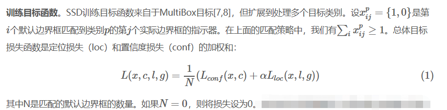
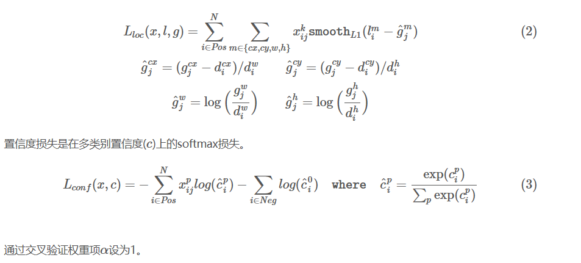
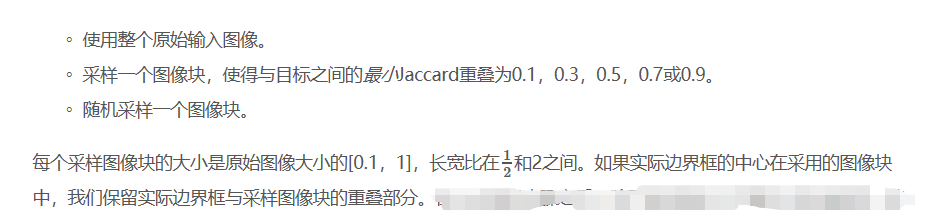

### SSD: Single Shot Multibox Detector (单发多框检测)

相对于RCNN系列的目标检测算法，存在着速度慢的缺点，盖鲁温提出的SSD方法。

SSD在基础网络的末端添加了几个特征层，他预测了不同尺度和长宽比的默认边界框额偏移量及其相关的置信度。

**训练目标函数**：

**数据增强**

**数据集**
> PASCAL VOC2007，VOC2012，COCO、ILSVRC

**基础网络**
>VGG16，将fc6和fc7转换为卷积层，从fc6和fc7中重采样参数，将pool5 从2*2-s2更改为3*3-s1，并使用空洞算法来填补这个“洞”，删除所有的dropout和fc8层。
之后就是微调（包括学习率，栋梁，权重衰减，批数据大小）。。。。

**多个不同分辨率的输出层更好**。SSD的主要贡献实在不同的输出层上使用不同尺度的默认边界框。
