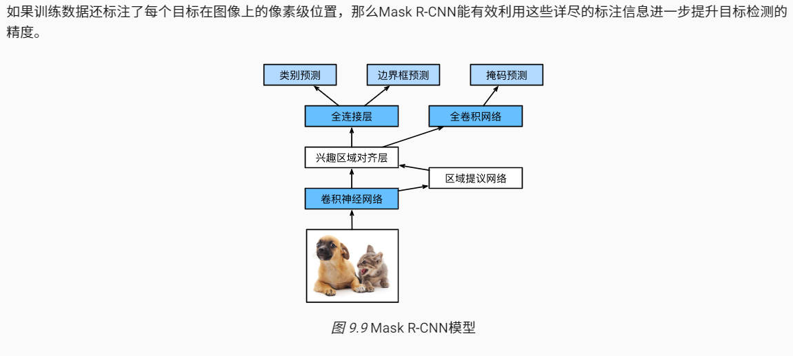
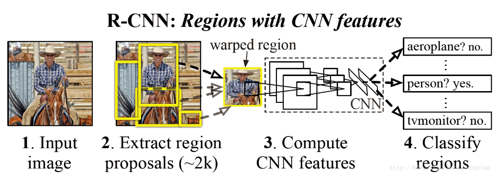
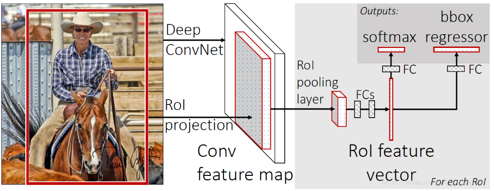
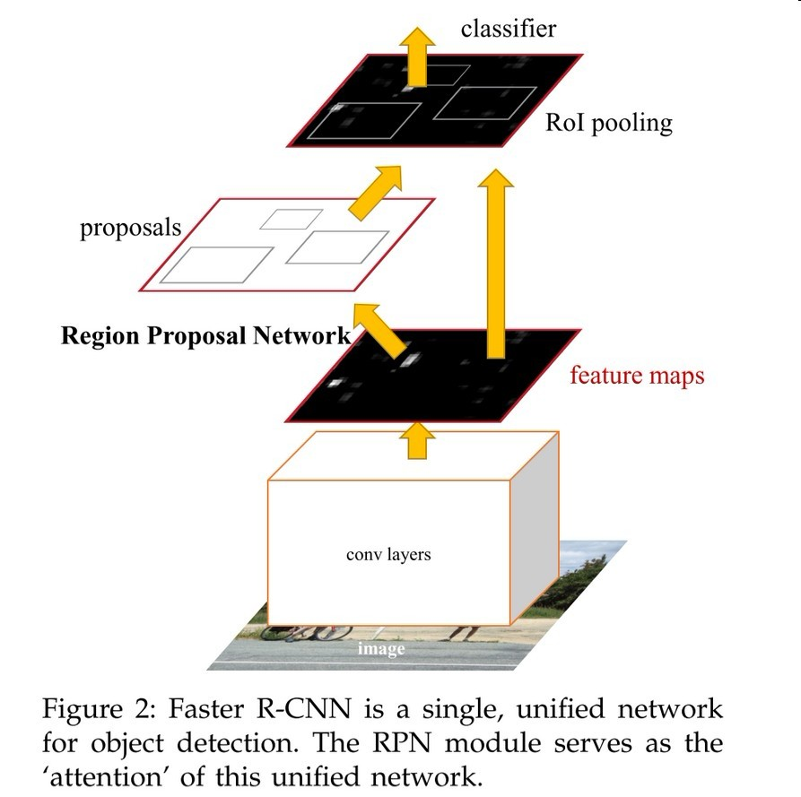
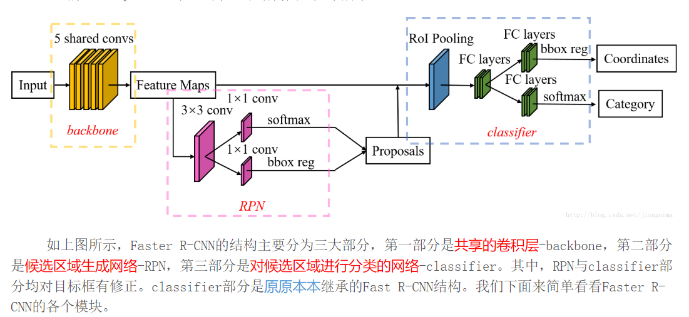
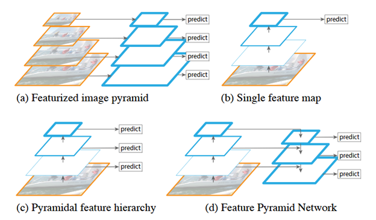
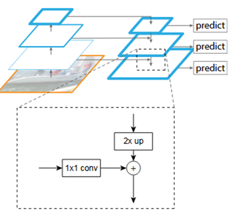

### Mask R-CNN

```
本文主要讲解mask RCNN  这是2017年何凯明大佬又一力作

论文地址：https://arxiv.org/pdf/1703.06870v3.pdf

代码开源地址： https://github.com/ facebookresearch/Detectron

```


**摘要**

这种称为Mask R-CNN的方法通过添加一个用于预测对象掩码的分支来扩展更快的R-CNN，该分支与现有的用于边界框识别的分支并行。掩码R-CNN训练简单，只增加了一小部分开销，以更快的R-CNN，以5fps运行

 `Mask R-CNN就是Faster R-CNN 加上一个用于像素语义分割的FCN。`


 **Mask RCNN整体架构**





** 相关知识点 **

`F-CNN`

**架构图**



首先输入一张图片，然后在图上提出大约2000个待检测区域，接着将这些待检测区域一个一个串联起来，通过卷积神经网络提取特征，然后这些被提取的特征通过一个支持向量机（SVM）进行分类，得到物体的类别，并通过一个bounding box regression(边界框回归)调整目标包围大小。

其中待检测区域采用selective search选择性搜索来获得的，通俗点讲就是将原始图像裁成若干模块，通过SVM将属于同一目标的若干块拿出来。

在进行SVM分类时，结合目标的标签与包围框的大小进行训练，该SVM也是被单独训练的


`Fast R-CNN`



首先还是采用selective search提取2000个候选框，然后，使用一个神经网络对全图进行特征提取。接着，使用一个RoI Pooling Layer在全图特征上摘取每一个RoI对应的特征，再通过全连接层(FC Layer)进行分类与包围框的修正。Fast R-CNN的贡献可以主要分为两个方面：

   1) **取代R-CNN的串行特征提取方式，直接采用一个神经网络对全图提取特征**(这也是为什么需要RoI Pooling的原因)。

   2) 除了selective search，其他部分都可以合在一起训练。


`Faster RCNN整体架构`

网络改进之处:
取代selective search，直接通过一个Region Proposal Network (RPN)生成待检测区域，这么做，在生成RoI区域的时候，时间也就从2s缩减到了10ms。

首先使用共享的卷积层为全图提取特征，然后将得到的feature maps送入RPN，RPN生成待检测框(指定RoI的位置)并对RoI的包围框进行第一次修正。Faster R-CNN真正实现了端到端的训练(end-to-end training)。






`RPN 详见`[RPN简介](RPN.md)


`FPN 空间金字塔`


作者利用了固有的多尺度和锥形层次结构的卷积网络来构造具有边际额外成本的金字塔网络，开发具有侧向连接（Skip Connector）的自顶向下的架构，用于在所有尺度上构建高级语义特征图，依靠一种通过自上而下的路径和横向连接将低分辨率但语义强的特征与高分辨率语义弱的特征结合在一起，这样就可以获得高分辨率，强语义的特征，有利于小目标的检测。这种结构是在CNN网络中完成的，和前文提到的基于图片的金字塔结构不同，而且完全可以替代它。






** 相关术语 **

ROI（感兴趣区域）

----


mask RCNN与Fast/Faster RCNN最大的区别就是 添加了像素到像素的对齐

** 在mask RCNN中主要完成了三件事情 **

 - 目标检测
 - 目标分类
 - 像素级目标分割


 ---

 **参考资料**

 https://blog.csdn.net/jiongnima/article/details/79094159
