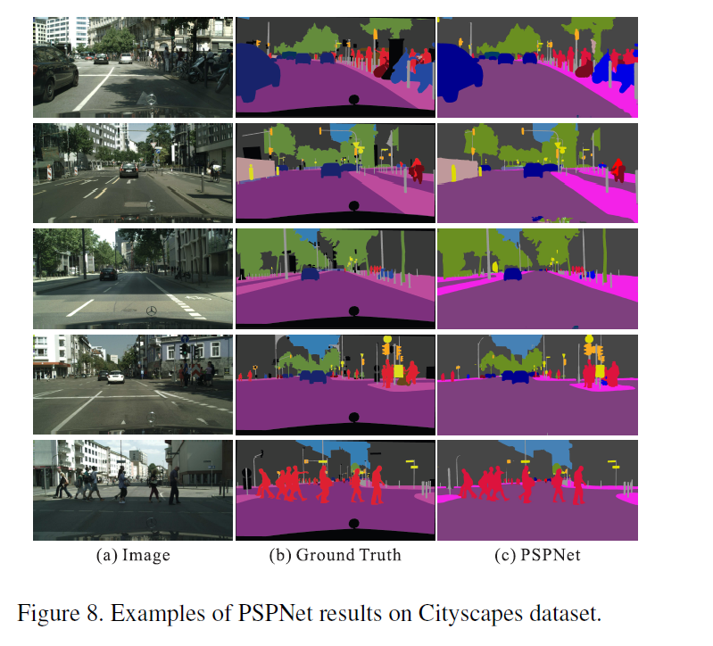
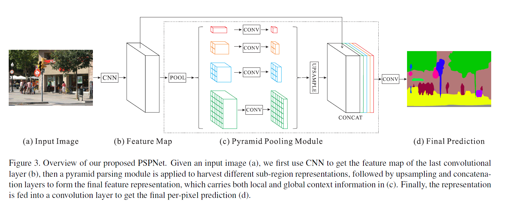

### PSPNet----------Pyramid Scene Parsing Network

文章创新点：

大多数语义分割模型的工作基于两个方面：

> 具有多尺度的特征融合，高层特征具有强的语义信息，底层特征包含更多的细节。

> 基于结构预测。例如使用CRF(条件随机场)做后端细化分割结果。

为了充分的利用全局特征层次先验知识来进行不同场景理解，本文提出的PSP模块能够聚合不同区域的上下文从而达到获取全局上下文的目的。

效果图

文章以带有空洞卷积的FCN作为baseline，主干网络使用ResNet-50  与多种方法结合比较

**FCN的局限性**

缺乏空间语义联系，许多标签之间的存在关联，可以通过标签之间的关系弥补，模型可能忽略小的东西，而大的东西可能超过FCN接受范围，从而导致不连续预测

改进措施：
提出了一个金字塔场景解析网络，能够将难解析的场景信息特征嵌入基于FCN预测框架中
在基于深度监督损失ResNet上制定有效的优化策略
构建了一个实用的系统，用于场景解析和语义分割，并包含了实施细节

** PSPNet 创新点**

1、 基于多尺度问题，提出Pyramid pooling module，将局部和全局信息融合在一起

2、在res4b22基础网络出添加了一个辅助损失函数，权重不同，共享参数，一起传播优化网络参数。实验证明这样做有利于快速收敛

PPM结构如下所示

数据集：ImageNet scene parsing challenge 2016, PASCAL VOC 2012,Cityscapes

---
论文地址：[PSPNet](https://arxiv.org/pdf/1612.01105.pdf)

代码地址：[keras](https://github.com/Vladkryvoruchko/PSPNet-Keras-tensorflow)

[tensorflow](https://github.com/hellochick/PSPNet-tensorflow)

官方给出的caffe

参考资料：https://blog.csdn.net/u011974639/article/details/78985130
