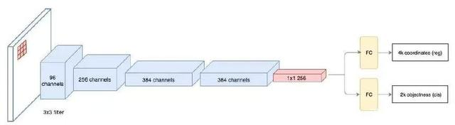
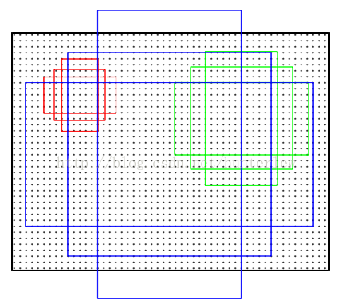

### Region Proposal Networks（RPN）


**候选区域网络**

```
候选区域网络（RPN）将第一个卷积网络的输出特征图作为输入 。
它在特征图上滑动一个 3×3 的卷积核，以使用卷积网络（如下所示的 ZF 网络）构建与类别无关的候选区域。
其他深度网络（如 VGG 或 ResNet）可用于更全面的特征提取，但这需要以速度为代价。
ZF 网络最后会输出 256 个值，它们将馈送到两个独立的全连接层，以预测边界框和两个
objectness 分数，这两个 objectness 分数度量了边界框是否包含目标。我们其实可以
使用回归器计算单个 objectness 分数 但为简洁起见，Faster R-CNN 使用只有两个类
 别的分类器：即带有目标的类别和不带有目标的类别。
```



首先是3*3的卷积，然后通过1*1卷积输出分为两路，其中一路输出是目标和非目标的概率，另一路输出box相关的四个参数，包括box的中心坐标x和y，box宽w和长h。

anchor是rpn网络的核心。刚刚说到，需要确定每个滑窗中心对应感受野内存在目标与否。由于目标大小和长宽比例不一，需要多个尺度的窗。Anchor即给出一个基准窗大小，按照倍数和长宽比例得到不同大小的窗。例如论文中基准窗大小为16，给了（8、16、32）三种倍数和（0.5、1、2）三种比例，这样能够得到一共9种尺度的anchor




----

更多详见博客：https://blog.csdn.net/hunterlew/article/details/71075925
