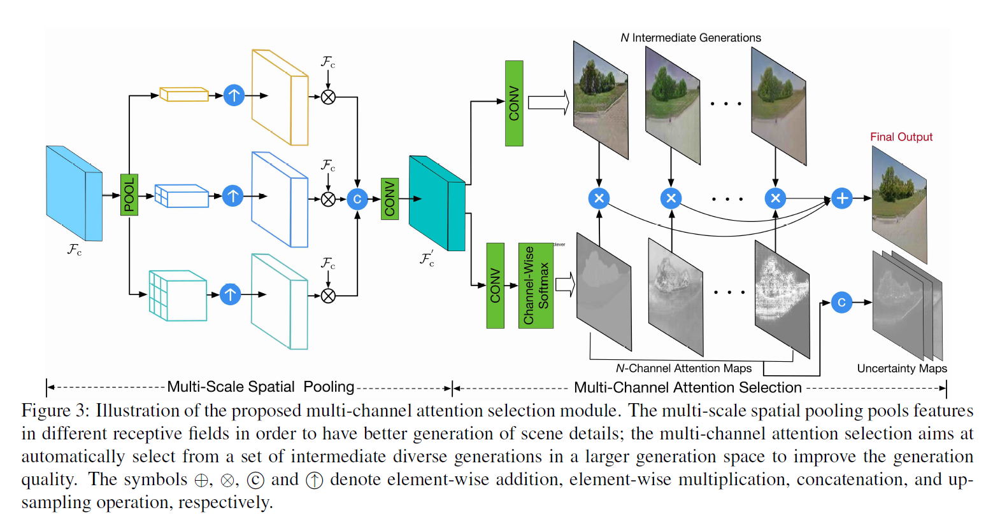
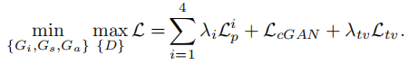
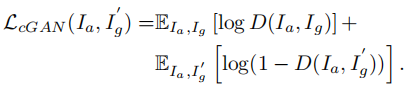
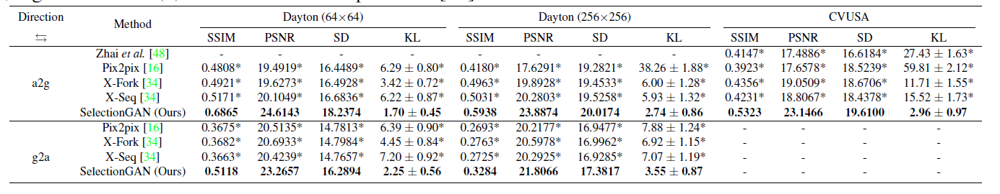
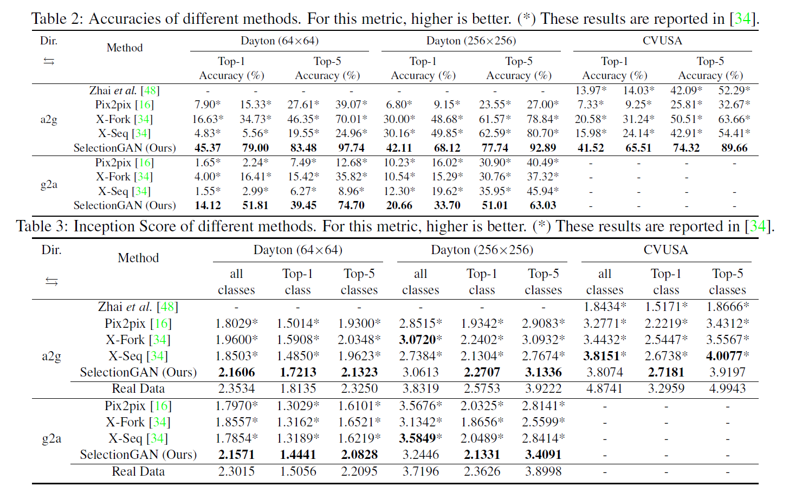
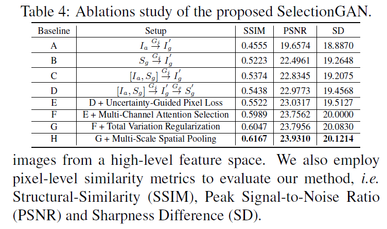

## SelectionGAN:  Multi-Channel Attention Selection GAN with Cascaded Semantic Guidance for Cross-View Image Translation

> 这是ICCV2019接受的文章，采用多通道注意力机制用于跨视图图像翻译，效果不错

> 摘要
>> Cross-view image translation is challenging because it involves images with drastically different views and severe
deformation. In this paper, we propose a novel approach named Multi-Channel Attention SelectionGAN (Selection-
GAN) that makes it possible to generate images of natural scenes in arbitrary viewpoints, based on an image
of the scene and a novel semantic map. The proposed SelectionGAN explicitly utilizes the semantic information
and consists of two stages. In the first stage, the condition image and the target semantic map are fed into a cycled
semantic-guided generation network to produce initial coarse results. In the second stage, we refine the initial results
by using a multi-channel attention selection mechanism. Moreover, uncertainty maps automatically learned
from attentions are used to guide the pixel loss for better network optimization. Extensive experiments on Dayton
[42], CVUSA [44] and Ego2Top [1] datasets show that our model is able to generate significantly better results
than the state-of-the-art methods. The source code, data and trained models are available at https://github.com/Ha0Tang/SelectionGAN .

>> 跨视图图像翻译是一项具有挑战性的工作，因为它涉及的图像具有截然不同的视图和严重的变形。
在本文中，我们提出了一种新的多通道注意选择方法(Multi-Channel Attention SelectionGAN, select - gan)，
它可以根据场景的图像和一个新的语义映射生成任意视点的自然场景图像。所提出的SelectionGAN明确地利用语义信息，并由两个阶段组成。
在第一个阶段，将条件图像和目标语义图输入一个循环语义引导生成网络，生成初始粗糙结果。
在第二阶段，我们使用一个多通道注意选择机制来细化初始结果。
此外，还利用从关注点自动学习的不确定度映射来指导像素损失，从而更好地进行网络优化。
在Dayton[42]、CVUSA[44]和Ego2Top[1]数据集上的大量实验表明，我们的模型能够产生比最先进的方法明显更好的结果。
源代码、数据和经过训练的模型可以在 https://github.com/Ha0Tang/SelectionGAN 上找到。

**相关知识点**

- attention机制
> 基本思想：打破了传统编码器-解码器结构在编解码时都依赖于内部一个固定长度向量的限制 
> attention机制的实现是： 通过保留LSTM编码器对输入序列的中间输出结果，然后训练一个模型来对这些输入进行选择性的学习并且在模型输出时将输出序列与之进行关联

- 跨视图图像翻译：是一项从一个视点到另一个视点合成新图像的任务

### 研究背景

目前图像翻译问题的解决方案一般时基于Encoder-Decoder结构，然而这种方案在原域与目标域图像具有显著不同结构或重叠区域极少的情况下时翻译效果会大打折扣。

作者发现之前利用语义图指导图像翻译的模型对于图像细节的翻译效果不佳，作者认为这是由于语义图一般是由深度预训练模型产生，并不能保证像素级的准确性。 首先，由于手工获取带注释的语义标签总是代价高昂，因此标签映射通常由来自其他大规模分割数据集的预先训练的语义模型生成，导致对所有像素的预测不够准确，从而误导了图像的生成。 第二，单阶段生成网络的翻译不能捕捉到两个视图之间复杂的场景结构关系。第三，三通道生成空间可能不太适合学习这个复杂综合问题的良好映射。

基于此作者提出了级联语义引导下的基于多通道注意力选择机制的图像翻译Selection GAN，其将图像翻译分为两阶段，第一个阶段用于产生粗粒度级的结果， 第二个阶段通过多通道注意力选择机制产生更细致的结果。

**总体而言，本文的贡献如下**: 
- 提出了一种用于跨视图图像翻译任务的多通道注意选择GAN框架(SelectionGAN)。它通过从粗到细的推理探索级联语义指导，旨在从更丰富和更多样化的多个中间代生成更详细的综合。
- 提出了一种新的多通道注意选择模块，利用该模块对感兴趣的中间代进行注意选择，能够显著提高最终输出的质量。多通道注意模块还可以有效地学习不确定性映射，指导像素损失，从而实现更鲁棒的优化。
- 大量的实验清楚地证明了所提议的SelectionGAN的有效性，并在两个公共基准上显示了最先进的结果，即Dayton[42]和CVUSA[44]。同时，我们还利用来自Ego2Top[1]的数据创建了一个更大尺度的跨视图综合基准，并为研究社区提供了多个基线模型的结果。

 ### 相关工作

- Generative Adversarial Networks (GANs)

- Image-to-Image Translation frameworks adopt inputoutput data to learn a parametric mapping between inputs and outputs.（图像到图像转换框架采用输入输出数据来学习输入和输出之间的参数映射）

- Learning Viewpoint Transformations （学习视觉转换）

### 模型介绍

多通道注意力机制SelectionGAN

Selection GAN将图像翻译的过程分为两个阶段（如图2所示），第一阶段作者提出了一个级联语义引导的生成器子网络(Gi)，该网络是将原域图像(Ia)以及目标域语义图(Sg)级联后的结果翻译至目标域图像(Ig’)，该生成图像Ig’作为语义生成器(Gs)的输入去生成目标域的语义图(Sg’)。为了保证Gi和Gs的生成效果，这里使用重建损失来限制生成器，即Ig≈Ig’,Sg≈Sg’，另外目标域语义(Sg)是由深度预训练模型产生。

经过第一阶段后模型产生了粗粒度级的翻译结果Ig’，在第二阶段中作者将该结果以及第一阶段生成的深度特征级联作为多通道注意力选择模型的输入（如图3所示），其目的是从更大的生成空间中产生更加细粒度级的翻译结果并且生成不确定映射去引导优化像素损失。
多通道注意力选择模型包括多规模空间池化和多通道注意力选择两个部分，作者选取第一阶段中Gi和Gs的最后一层卷积网络的输出作为深度特征Fi和Fs，并与第一阶段的输出Ig’和原域图像Ia级联为特征Fc，即，输入至多规模空间池化网络中，该网络对Fc进行不同规模的平均池化从而获取多规模的空间上下文特征。为了保留有用信息将经过不同规模池化后的特征与输入特征Fc相乘，该结果经过卷积后产生新的多规模特征Fc’并作为多通道注意力选择的输入。

作者认为普通的三通道RGB图像所包含的信息太少，因此作者在多通道注意力选择中通过卷积网络扩大图像的通道表示，并且结合注意力映射产生更合理的结果(Ig’’)，另外注意力映射还需要学习产生不确定映射用于引导优化由预训练模型所带来的像素级误差对整个模型的影响。

多通道注意力机制模型

Selection GAN的优化目标主要分为三个部分：重建损失、对抗损失以及全变分正则化损失（如图4所示）。这里的重建损失包括三个部分：Ig≈Ig’,Sg≈Sg’（第一阶段）以及Ig≈Ig’’（第二阶段）。

模型优化目标

作者认为不同于原始GAN，Selection GAN的鉴别器应该学习分辨来自不同域的成对图像是否彼此相关联，因此这里的对抗损失是用于区分真实图像对(Ia,Ig)以及虚假图像对(Ia,Ig’)，如图5所示。

对抗损失

### 实验

在具体实验中对于Gi和Gs作者采用了U-Net架构，由于模型的目的是生成合理的翻译结果因此Gi采用了深层网络模型，Gs采用了潜层网络模型。对于鉴别器D作者采用了PatchGAN架构，用于生成于语义图的预训练模型采用了RefineNet架构。 
作者主要在Dayton、CVUSA以及Ego2Top数据集上进行实验，其基线模型选取了Pix2Pix，X-Fork以及X-Seq进行对比，评价指标采用了SSIM，PSNR，SD以及KL散度进行衡量，实验结果如下。

### 小结

Selection GAN旨在解决具有显著不同结构的图像翻译问题，其将翻译过程分为两个阶段，阶段一旨在捕获场景的语义结构，阶段二通过提出的多通道注意力选择模块关注更多外观细节。另外作者还提出了利用不确定性映射引导优化由预训练模型产生的语义图像素损失，以解决不准确的语义标签问题。在三个公共数据集的实验结果表明，该方法获得了比现有技术更好的结果。
